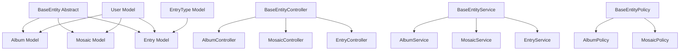
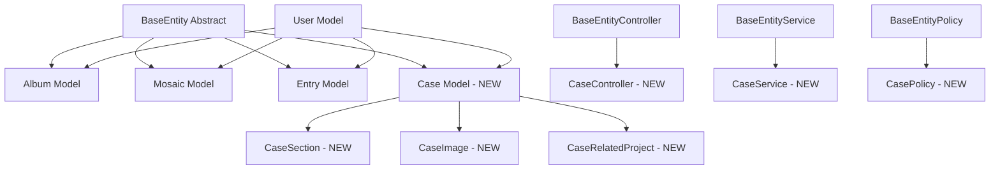

# Case Entity Implementation Plan

## 1. Qualitative Story

### Problem Description
The VAMS application currently supports Albums (image collections) and Mosaics (visual layouts) as static entities, and a dynamic Entry/EntryType system for simple form-based content. However, there's a need for a **Case Study/Portfolio** entity that showcases complex project work with:

- Rich metadata (client, role, team)
- Multiple nested sections with titles and content
- Associated images with captions and metadata
- Related project relationships
- SEO configuration
- Professional presentation for portfolio display

The current Entry/EntryType system, while flexible for simple forms, cannot elegantly handle this level of complexity without becoming unwieldy.

### Business Impact
Adding Case entities will:
- Enable users to showcase their professional work as case studies
- Provide a portfolio management system alongside visual assets
- Create opportunities for premium features (case study templates, advanced layouts)
- Differentiate VAMS from simple image management tools
- Enable external API consumption for portfolio websites

### Solution Approach
Create **Case** as a dedicated entity extending `BaseEntity`, similar to Album and Mosaic, with:
- Proper database relationships for sections, images, and related projects
- JSON storage for flexible content while maintaining relational integrity
- Integration with existing permission system via User model
- API endpoints for external portfolio consumption
- Admin management capabilities

### Success Metrics
- Users can create, edit, and delete case studies
- Cases display correctly in portfolio views
- API provides structured case data for external websites
- Admin can manage case permissions per user
- All operations are fully tested (90%+ coverage)

---

## 2. Technical Implementation

### Current Architecture


### Enhanced Architecture with Case


### Key Code Changes

#### Database Schema
```php
// Migration: create_cases_table
Schema::create('cases', function (Blueprint $table) {
    $table->uuid('id')->primary();
    $table->foreignUuid('user_id')->constrained()->onDelete('cascade');
    $table->string('title');
    $table->text('description')->nullable();
    $table->string('client')->nullable();
    $table->string('role')->nullable();
    $table->string('team')->nullable();
    $table->string('status')->default('draft'); // draft, published
    $table->json('seo')->nullable(); // SEO metadata
    $table->integer('order')->default(0);
    $table->timestamp('published_at')->nullable();
    $table->timestamps();
    
    $table->index(['user_id', 'status']);
    $table->index('order');
});

// Related tables for normalized data
Schema::create('case_sections', function (Blueprint $table) {
    $table->uuid('id')->primary();
    $table->foreignUuid('case_id')->constrained()->onDelete('cascade');
    $table->string('title');
    $table->text('content');
    $table->integer('order')->default(0);
    $table->timestamps();
    
    $table->index(['case_id', 'order']);
});

Schema::create('case_images', function (Blueprint $table) {
    $table->uuid('id')->primary();
    $table->foreignUuid('case_id')->constrained()->onDelete('cascade');
    $table->string('path');
    $table->string('alt')->nullable();
    $table->text('caption')->nullable();
    $table->integer('width')->nullable();
    $table->integer('height')->nullable();
    $table->integer('order')->default(0);
    $table->timestamps();
    
    $table->index(['case_id', 'order']);
});

Schema::create('case_related_projects', function (Blueprint $table) {
    $table->uuid('id')->primary();
    $table->foreignUuid('case_id')->constrained()->onDelete('cascade');
    $table->foreignUuid('related_case_id')->constrained('cases')->onDelete('cascade');
    $table->integer('order')->default(0);
    $table->timestamps();
    
    $table->index(['case_id', 'order']);
});
```

#### Case Model Structure
```php
// app/Models/Case.php
class Case extends BaseEntity
{
    protected $fillable = [
        'id', 'user_id', 'title', 'description',
        'client', 'role', 'team', 'status', 
        'seo', 'order', 'published_at'
    ];
    
    protected $casts = [
        'seo' => 'array',
        'published_at' => 'datetime',
        'order' => 'integer',
    ];
    
    // Relationships
    public function sections(): HasMany;
    public function images(): HasMany;
    public function relatedProjects(): BelongsToMany;
    
    // Scopes
    public function scopePublished($query);
    public function scopeDraft($query);
    
    // BaseEntity implementations
    public function hasMedia(): bool;
    public function getMediaRelationships(): array;
    public static function getValidationRules(): array;
}
```

---

## 3. Step-by-Step Implementation Plan

### Phase 1: Database Foundation (1-2 hours)

#### Step 1.1: Create Migrations
**What:** Create database tables for cases and related entities  
**Why:** Need proper database structure before creating models  
**How:** Use Artisan to generate migrations with proper foreign keys and indexes

```bash
herd php artisan make:migration create_cases_table
herd php artisan make:migration create_case_sections_table
herd php artisan make:migration create_case_images_table
herd php artisan make:migration create_case_related_projects_table
```

**Files:**
- `database/migrations/YYYY_MM_DD_create_cases_table.php`
- `database/migrations/YYYY_MM_DD_create_case_sections_table.php`
- `database/migrations/YYYY_MM_DD_create_case_images_table.php`
- `database/migrations/YYYY_MM_DD_create_case_related_projects_table.php`

**Testing:** Run migrations and verify schema with `herd php artisan migrate:status`

---

#### Step 1.2: Create Factories
**What:** Create factories for generating test data  
**Why:** Essential for testing and seeding  
**How:** Use Artisan to generate factories with realistic fake data

```bash
herd php artisan make:factory CaseFactory
herd php artisan make:factory CaseSectionFactory
herd php artisan make:factory CaseImageFactory
```

**Files:**
- `database/factories/CaseFactory.php`
- `database/factories/CaseSectionFactory.php`
- `database/factories/CaseImageFactory.php`

**Testing:** Use Tinker to create sample cases: `Case::factory()->count(3)->create()`

---

### Phase 2: Models & Relationships (2-3 hours)

#### Step 2.1: Create Case Model
**What:** Create the main Case model extending BaseEntity  
**Why:** Core entity that implements the EntityContract interface  
**How:** Manually create (not via artisan) to extend BaseEntity properly

```bash
# Create the model file manually
touch app/Models/CaseSection.php
touch app/Models/CaseImage.php
touch app/Models/CaseRelatedProject.php
```

**Files:**
- `app/Models/Case.php` - Main entity
- `app/Models/CaseSection.php` - Sections relationship
- `app/Models/CaseImage.php` - Images relationship
- `app/Models/CaseRelatedProject.php` - Pivot for related projects

**Key Implementation Details:**
- Extend `BaseEntity`
- Implement all abstract methods
- Add `LogsActivity` trait
- Define relationships with proper ordering
- Add published/draft scopes
- Include SEO cast as array

**Testing:** Create a case via factory and verify relationships load correctly

---

#### Step 2.2: Update User Model
**What:** Add `cases()` relationship to User model  
**Why:** Users need to own and access their cases  
**How:** Add `hasMany` relationship

```php
// app/Models/User.php
public function cases(): HasMany
{
    return $this->hasMany(Case::class);
}
```

**Files:**
- `app/Models/User.php`

**Testing:** Verify `$user->cases` returns a collection

---

### Phase 3: Business Logic Layer (2-3 hours)

#### Step 3.1: Create CaseService
**What:** Service class for case business logic  
**Why:** Separates business logic from controller  
**How:** Extend BaseEntityService with case-specific methods

```bash
herd php artisan make:class Services/CaseService
```

**Files:**
- `app/Services/CaseService.php`

**Key Methods:**
- `getAll()` - Get all user cases with relationships
- `getById()` - Get specific case with full relationships
- `create()` - Create case with sections and images
- `update()` - Update case and relationships
- `delete()` - Delete case and cascade relationships
- `reorder()` - Reorder cases for user
- `publish()` - Publish draft case
- `formatCaseForApi()` - Format for API response

**Testing:** Unit test each method for correct behavior

---

#### Step 3.2: Create ImageService Integration
**What:** Extend ImageService to handle case images  
**Why:** Reuse existing image handling logic  
**How:** Add case image methods to ImageService

**Files:**
- `app/Services/ImageService.php`

**Testing:** Test image upload for cases

---

### Phase 4: Form Requests & Validation (1 hour)

#### Step 4.1: Create Form Requests
**What:** Validation classes for case operations  
**Why:** Centralized validation with custom messages  
**How:** Use Artisan to generate request classes

```bash
herd php artisan make:request StoreCaseRequest
herd php artisan make:request UpdateCaseRequest
```

**Files:**
- `app/Http/Requests/StoreCaseRequest.php`
- `app/Http/Requests/UpdateCaseRequest.php`

**Validation Rules:**
```php
[
    'title' => ['required', 'string', 'max:255'],
    'description' => ['nullable', 'string'],
    'client' => ['nullable', 'string', 'max:255'],
    'role' => ['nullable', 'string', 'max:255'],
    'team' => ['nullable', 'string', 'max:255'],
    'status' => ['nullable', 'string', 'in:draft,published'],
    'seo' => ['nullable', 'array'],
    'sections' => ['nullable', 'array'],
    'sections.*.title' => ['required', 'string'],
    'sections.*.content' => ['required', 'string'],
    'related_projects' => ['nullable', 'array'],
    'related_projects.*' => ['uuid', 'exists:cases,id'],
]
```

**Testing:** Test validation rules with valid and invalid data

---

### Phase 5: Authorization (1 hour)

#### Step 5.1: Create CasePolicy
**What:** Authorization policy for case operations  
**Why:** Ensure users can only access their own cases  
**How:** Extend BaseEntityPolicy

```bash
herd php artisan make:policy CasePolicy --model=Case
```

**Files:**
- `app/Policies/CasePolicy.php`

**Testing:** Test policy methods with different users

---

#### Step 5.2: Register Policy
**What:** Register policy in AuthServiceProvider  
**Why:** Laravel needs to know about the policy  
**How:** Add to `$policies` array

**Files:**
- `app/Providers/AuthServiceProvider.php`

**Testing:** Verify authorization works in controllers

---

### Phase 6: Controllers (3-4 hours)

#### Step 6.1: Create CaseController
**What:** Web controller for case CRUD operations  
**Why:** Handle HTTP requests for cases  
**How:** Extend BaseEntityController

```bash
touch app/Http/Controllers/CaseController.php
```

**Files:**
- `app/Http/Controllers/CaseController.php`

**Key Methods:**
- `index()` - List user's cases
- `create()` - Show create form
- `store()` - Create new case
- `show()` - Display single case
- `edit()` - Show edit form
- `update()` - Update existing case
- `destroy()` - Delete case
- `reorder()` - Reorder cases
- `publish()` - Publish draft case

**Testing:** Feature test each endpoint

---

#### Step 6.2: Create API Controller
**What:** API controller for external case access  
**Why:** Enable API consumption for portfolio websites  
**How:** Create in Api namespace

```bash
touch app/Http/Controllers/Api/CaseController.php
```

**Files:**
- `app/Http/Controllers/Api/CaseController.php`

**Key Endpoints:**
- `GET /api/cases` - List all published cases
- `GET /api/cases/{id}` - Get specific case with relationships
- `GET /api/cases/{slug}` - Get case by slug (if implemented)

**Testing:** API tests for all endpoints

---

### Phase 7: Routes (30 minutes)

#### Step 7.1: Web Routes
**What:** Register web routes for cases  
**Why:** Enable browser access to case pages  
**How:** Add resourceful routes to web.php

```php
// routes/web.php
Route::middleware('auth')->group(function () {
    Route::resource('cases', CaseController::class);
    Route::post('cases/reorder', [CaseController::class, 'reorder'])
        ->name('cases.reorder');
    Route::post('cases/{case}/publish', [CaseController::class, 'publish'])
        ->name('cases.publish');
});
```

**Files:**
- `routes/web.php`

**Testing:** Verify routes with `herd php artisan route:list | grep cases`

---

#### Step 7.2: API Routes
**What:** Register API routes for cases  
**Why:** Enable external API access  
**How:** Add routes to api.php with API key authentication

```php
// routes/api.php
Route::middleware(['auth:sanctum', 'check.api.key'])->group(function () {
    Route::get('/cases', [Api\CaseController::class, 'indexWithApiKey']);
    Route::get('/cases/{case}', [Api\CaseController::class, 'showWithApiKey']);
});
```

**Files:**
- `routes/api.php`

**Testing:** API tests with authentication

---

### Phase 8: Frontend Components (4-6 hours)

#### Step 8.1: Create Page Components
**What:** Vue pages for case management  
**Why:** User interface for cases  
**How:** Create Inertia page components using atomic design

```
resources/js/Pages/Cases/
├── Index.vue       # List all cases
├── Create.vue      # Create new case
├── Show.vue        # Display single case
└── Edit.vue        # Edit existing case
```

**Files:**
- `resources/js/Pages/Cases/Index.vue`
- `resources/js/Pages/Cases/Create.vue`
- `resources/js/Pages/Cases/Show.vue`
- `resources/js/Pages/Cases/Edit.vue`

**Key Features:**
- Case list with filtering/sorting
- Rich form with section builder
- Image upload with drag-and-drop
- Related project selector
- SEO metadata editor
- Draft/publish toggle

**Testing:** Browser tests for key workflows

---

#### Step 8.2: Create Atomic Components
**What:** Reusable Vue components for case UI  
**Why:** Follow atomic design principles  
**How:** Create atoms, molecules, and organisms

```
resources/js/Components/Cases/
├── atoms/
│   ├── CaseStatusBadge.vue
│   ├── CaseSeoField.vue
│   └── CaseOrderControl.vue
├── molecules/
│   ├── CaseSectionEditor.vue
│   ├── CaseImageUploader.vue
│   ├── CaseRelatedProjectSelector.vue
│   └── CaseMetadataForm.vue
└── organisms/
    ├── CaseForm.vue
    ├── CaseCard.vue
    ├── CaseList.vue
    └── CaseDetailView.vue
```

**Files:**
- Multiple Vue components following atomic design

**Testing:** Component unit tests

---

#### Step 8.3: TypeScript Types
**What:** Define TypeScript interfaces for cases  
**Why:** Type safety in Vue components  
**How:** Create type definitions

```typescript
// resources/js/types/case.ts
export interface Case {
    id: string;
    user_id: string;
    title: string;
    description?: string;
    client?: string;
    role?: string;
    team?: string;
    status: 'draft' | 'published';
    seo?: CaseSeo;
    order: number;
    published_at?: string;
    sections: CaseSection[];
    images: CaseImage[];
    related_projects: Case[];
    created_at: string;
    updated_at: string;
}

export interface CaseSection {
    id: string;
    case_id: string;
    title: string;
    content: string;
    order: number;
}

export interface CaseImage {
    id: string;
    case_id: string;
    path: string;
    alt?: string;
    caption?: string;
    width?: number;
    height?: number;
    order: number;
}

export interface CaseSeo {
    title?: string;
    description?: string;
    og_title?: string;
    og_description?: string;
    og_image?: string;
}
```

**Files:**
- `resources/js/types/case.ts`

**Testing:** Verify type checking works

---

### Phase 9: Admin Integration (2-3 hours)

#### Step 9.1: Admin Dashboard Integration
**What:** Add cases to admin dashboard  
**Why:** Admins need visibility into case usage  
**How:** Update admin dashboard with case statistics

**Files:**
- `app/Http/Controllers/Admin/DashboardController.php`
- `resources/js/Pages/Admin/Dashboard.vue`

**Metrics to Add:**
- Total cases count
- Cases by user
- Draft vs published ratio
- Cases created this month

**Testing:** Verify dashboard displays correctly

---

#### Step 9.2: User Case Management
**What:** Allow admins to view/manage user cases  
**Why:** Admin oversight for moderation  
**How:** Add cases tab to admin user management

**Files:**
- `app/Http/Controllers/Admin/UserController.php`
- `resources/js/Pages/Admin/Users/Edit.vue`

**Features:**
- View user's cases
- Bulk publish/unpublish
- Delete cases if needed

**Testing:** Test admin case management

---

### Phase 10: Testing (3-4 hours)

#### Step 10.1: Unit Tests
**What:** Test individual units of code  
**Why:** Ensure each component works in isolation  
**How:** Create Pest test files

```bash
herd php artisan make:test --unit CaseModelTest
herd php artisan make:test --unit CaseServiceTest
herd php artisan make:test --unit CasePolicyTest
```

**Files:**
- `tests/Unit/CaseModelTest.php`
- `tests/Unit/CaseServiceTest.php`
- `tests/Unit/CasePolicyTest.php`

**Test Coverage:**
- Model relationships
- Validation rules
- Service methods
- Policy authorization

**Running Tests:** `herd php artisan test --filter=Case`

---

#### Step 10.2: Feature Tests
**What:** Test HTTP requests and responses  
**Why:** Ensure endpoints work correctly  
**How:** Create Pest feature tests

```bash
herd php artisan make:test --pest CaseCrudTest
herd php artisan make:test --pest CaseAuthorizationTest
herd php artisan make:test --pest CasePublishTest
```

**Files:**
- `tests/Feature/CaseCrudTest.php`
- `tests/Feature/CaseAuthorizationTest.php`
- `tests/Feature/CasePublishTest.php`

**Test Coverage:**
- Create case
- Update case
- Delete case
- Unauthorized access
- Publish workflow
- Related projects
- Image upload

---

#### Step 10.3: API Tests
**What:** Test API endpoints  
**Why:** Ensure external API works correctly  
**How:** Create API test file

```bash
herd php artisan make:test --pest Api/CaseApiTest
```

**Files:**
- `tests/Api/CaseApiTest.php`

**Test Coverage:**
- List cases with API key
- Get single case
- Authentication required
- Data format validation

---

#### Step 10.4: Browser Tests
**What:** End-to-end browser testing  
**Why:** Ensure complete user workflows work  
**How:** Create Pest browser tests

```bash
herd php artisan make:test --pest Browser/CaseWorkflowTest
```

**Files:**
- `tests/Browser/CaseWorkflowTest.php`

**Test Scenarios:**
- Complete case creation workflow
- Add sections and images
- Publish case
- View published case
- Edit existing case

---

### Phase 11: Documentation & Final Polish (1-2 hours)

#### Step 11.1: Update Master Documentation
**What:** Update VAMS_MASTER_DOCUMENTATION.md  
**Why:** Keep documentation current with code  
**How:** Add Case entity to all relevant sections

**Files:**
- `VAMS_MASTER_DOCUMENTATION.md`

---

#### Step 11.2: API Documentation
**What:** Document case API endpoints  
**Why:** External developers need API docs  
**How:** Create or update API documentation

**Files:**
- `API_FRONTEND_GUIDE.md` (update)
- Create new `CASE_API_DOCUMENTATION.md`

---

#### Step 11.3: Run Pint
**What:** Format all PHP code  
**Why:** Maintain code standards  
**How:** Run Laravel Pint

```bash
vendor/bin/pint --dirty
```

---

## 4. Test Scenarios

### Regression Tests (Ensure Nothing Breaks)
- [ ] Existing Entry/EntryType functionality unchanged
- [ ] Album CRUD operations still work
- [ ] Mosaic CRUD operations still work
- [ ] User authentication and authorization unchanged
- [ ] Admin dashboard displays correctly
- [ ] Activity logging still functions

### Case Entity Functionality Tests
- [ ] User can create a new case with title and description
- [ ] User can add multiple sections to a case
- [ ] User can upload and attach images to a case
- [ ] User can link related cases
- [ ] User can add SEO metadata
- [ ] User can save case as draft
- [ ] User can publish case from draft
- [ ] User can edit existing case
- [ ] User can delete case (cascade deletes sections/images)
- [ ] User can reorder their cases
- [ ] User can only see/edit their own cases

### Authorization & Security Tests
- [ ] Unauthenticated users cannot access cases
- [ ] Users cannot view other users' cases
- [ ] Users cannot edit other users' cases
- [ ] Users cannot delete other users' cases
- [ ] Admins can view all users' cases
- [ ] API requires valid API key
- [ ] API only returns published cases

### API Tests
- [ ] GET /api/cases returns user's published cases
- [ ] GET /api/cases/{id} returns single case with relationships
- [ ] API returns proper JSON structure
- [ ] API includes sections, images, and related projects
- [ ] API handles non-existent cases gracefully
- [ ] API respects authentication

### Error Handling Tests
- [ ] Validation errors display correctly in forms
- [ ] 404 for non-existent cases
- [ ] 403 for unauthorized access
- [ ] Image upload failures handled gracefully
- [ ] Database errors don't expose sensitive info

### Performance Tests
- [ ] Cases list loads in < 500ms
- [ ] Case detail with relationships loads in < 300ms
- [ ] Image uploads process efficiently
- [ ] API responses within acceptable limits
- [ ] N+1 query prevention verified

---

## 5. Risk Assessment & Mitigation

### High Risk

#### Risk: Complex Data Structure May Cause Performance Issues
**Impact:** Slow page loads, poor user experience  
**Likelihood:** Medium  
**Mitigation:**
- Eager load all relationships in queries
- Add database indexes on foreign keys and order columns
- Implement pagination for case lists
- Cache published cases for API
- Monitor query performance with Telescope

#### Risk: Image Upload and Storage May Consume Disk Space
**Impact:** Server storage issues  
**Likelihood:** Medium  
**Mitigation:**
- Implement image resizing and optimization
- Set storage quotas per user
- Consider S3 integration for production
- Add file size validation
- Implement cleanup for deleted cases

### Medium Risk

#### Risk: Related Projects Circular References
**Impact:** Infinite loops in display  
**Likelihood:** Low  
**Mitigation:**
- Limit related projects to direct relationships only (no nested)
- Add frontend protection against displaying same case recursively
- Validate related projects don't include self-reference

#### Risk: Frontend Complexity May Introduce Bugs
**Impact:** User frustration, data loss  
**Mitigation:**
- Comprehensive browser testing
- Auto-save draft functionality
- Form validation before submission
- Clear error messages
- Confirm dialogs for destructive actions

### Low Risk

#### Risk: Migration May Fail on Production
**Impact:** Deployment failure  
**Likelihood:** Low  
**Mitigation:**
- Test migrations on staging first
- Create rollback plan
- Backup database before deployment
- Use migration transactions where possible

---

## 6. Success Criteria

### Functional Requirements
- [ ] Users can create, read, update, and delete cases
- [ ] Cases support sections, images, and related projects
- [ ] Draft/publish workflow functions correctly
- [ ] Case ordering works as expected
- [ ] API provides access to published cases
- [ ] Admin dashboard includes case statistics
- [ ] All CRUD operations are properly authorized

### Technical Requirements
- [ ] All code follows PSR-12 standards
- [ ] Test coverage is 90%+ for case functionality
- [ ] No N+1 query issues
- [ ] Database properly indexed
- [ ] All relationships use proper foreign keys with cascading
- [ ] TypeScript types defined for all case interfaces
- [ ] Laravel Pint passes without errors

### Business Requirements
- [ ] Cases enhance portfolio presentation capabilities
- [ ] API enables external portfolio integration
- [ ] Admin has visibility and control over cases
- [ ] User experience is intuitive and professional
- [ ] System is ready for future premium features

### User Experience Requirements
- [ ] Case creation form is intuitive
- [ ] Image upload provides clear feedback
- [ ] Related project selection is easy
- [ ] SEO fields are clearly labeled
- [ ] Draft/publish toggle is obvious
- [ ] Case list displays attractively
- [ ] Mobile responsive design

---

## 7. Files to Modify

### New Files to Create (54 files)

#### Backend (29 files)
- `database/migrations/YYYY_MM_DD_create_cases_table.php`
- `database/migrations/YYYY_MM_DD_create_case_sections_table.php`
- `database/migrations/YYYY_MM_DD_create_case_images_table.php`
- `database/migrations/YYYY_MM_DD_create_case_related_projects_table.php`
- `database/factories/CaseFactory.php`
- `database/factories/CaseSectionFactory.php`
- `database/factories/CaseImageFactory.php`
- `app/Models/Case.php`
- `app/Models/CaseSection.php`
- `app/Models/CaseImage.php`
- `app/Models/CaseRelatedProject.php`
- `app/Services/CaseService.php`
- `app/Http/Requests/StoreCaseRequest.php`
- `app/Http/Requests/UpdateCaseRequest.php`
- `app/Policies/CasePolicy.php`
- `app/Http/Controllers/CaseController.php`
- `app/Http/Controllers/Api/CaseController.php`
- `tests/Unit/CaseModelTest.php`
- `tests/Unit/CaseServiceTest.php`
- `tests/Unit/CasePolicyTest.php`
- `tests/Feature/CaseCrudTest.php`
- `tests/Feature/CaseAuthorizationTest.php`
- `tests/Feature/CasePublishTest.php`
- `tests/Api/CaseApiTest.php`
- `tests/Browser/CaseWorkflowTest.php`
- `database/seeders/CaseSeeder.php` (optional)
- `CASE_API_DOCUMENTATION.md`
- `CASE_ENTITY_IMPLEMENTATION_PLAN.md` (this file)

#### Frontend (25 files)
- `resources/js/Pages/Cases/Index.vue`
- `resources/js/Pages/Cases/Create.vue`
- `resources/js/Pages/Cases/Show.vue`
- `resources/js/Pages/Cases/Edit.vue`
- `resources/js/Components/Cases/atoms/CaseStatusBadge.vue`
- `resources/js/Components/Cases/atoms/CaseSeoField.vue`
- `resources/js/Components/Cases/atoms/CaseOrderControl.vue`
- `resources/js/Components/Cases/molecules/CaseSectionEditor.vue`
- `resources/js/Components/Cases/molecules/CaseImageUploader.vue`
- `resources/js/Components/Cases/molecules/CaseRelatedProjectSelector.vue`
- `resources/js/Components/Cases/molecules/CaseMetadataForm.vue`
- `resources/js/Components/Cases/organisms/CaseForm.vue`
- `resources/js/Components/Cases/organisms/CaseCard.vue`
- `resources/js/Components/Cases/organisms/CaseList.vue`
- `resources/js/Components/Cases/organisms/CaseDetailView.vue`
- `resources/js/types/case.ts`
- `resources/js/composables/useCases.ts` (optional)

### Files to Modify (7 files)
- `app/Models/User.php` - Add `cases()` relationship
- `routes/web.php` - Add case routes
- `routes/api.php` - Add API case routes
- `app/Providers/AuthServiceProvider.php` - Register CasePolicy
- `app/Http/Controllers/Admin/DashboardController.php` - Add case stats
- `resources/js/Pages/Admin/Dashboard.vue` - Display case stats
- `VAMS_MASTER_DOCUMENTATION.md` - Add case entity documentation
- `API_FRONTEND_GUIDE.md` - Add case API documentation

---

## 8. Implementation Timeline

### Week 1: Backend Foundation
- **Day 1**: Database (Phases 1, 2) - Migrations, models, relationships
- **Day 2**: Services & Validation (Phases 3, 4) - Business logic, form requests
- **Day 3**: Authorization & Controllers (Phases 5, 6) - Policies, web controllers
- **Day 4**: API & Routes (Phases 6, 7) - API controllers, route registration
- **Day 5**: Backend Testing (Phase 10, parts 1-3) - Unit, feature, API tests

### Week 2: Frontend & Polish
- **Day 1**: Page Components (Phase 8.1) - Index, Create, Show, Edit pages
- **Day 2**: Atomic Components (Phase 8.2) - Atoms, molecules, organisms
- **Day 3**: TypeScript & Integration (Phase 8.3) - Types, composables, integration
- **Day 4**: Admin Integration (Phase 9) - Dashboard, user management
- **Day 5**: Browser Testing & Documentation (Phases 10.4, 11) - E2E tests, docs

### Estimated Total Time: 8-10 working days

---

## Notes for Future Context Windows

If this implementation carries over to a new context window, here are the critical points to remember:

1. **Architecture Decision**: Case is a SEPARATE entity extending BaseEntity, NOT part of Entry/EntryType system
2. **Why**: Case structure is too complex for dynamic Entry/EntryType field_config
3. **Database Design**: Four tables (cases, case_sections, case_images, case_related_projects)
4. **Follow Patterns**: Mirror Album/Mosaic implementation patterns exactly
5. **Permission System**: Simple array-based, stored in User.entry_type_permissions (not complex subscription tiers)
6. **Testing Priority**: 90%+ coverage required before merging
7. **Admin Can**: View statistics, manage users' cases
8. **API Design**: Read-only, authenticated via API key, only published cases

---

*This plan represents the complete roadmap for implementing the Case entity in VAMS. It can be taken to a new chat session with full context for implementation.*


