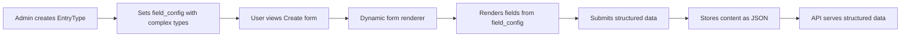

# Entry Type Enhancement Plan
## Dynamic Form System for Complex Entry Types

---

## 1. Qualitative Story

### Problem Description
The current Entry/EntryType system in VAMS has the infrastructure for dynamic content types, but the frontend is hardcoded for simple "I AM" entries. The `field_config` system exists but isn't actually used to render forms dynamically. This limits the system to simple text/textarea fields and prevents creating complex entry types like Case Studies that need:
- Repeatable sections (title + content pairs)
- Image collections with metadata
- Related entry references
- Nested objects (SEO, metadata)

### Business Impact
- **Current Limitation**: Can only handle simple form entries
- **Lost Opportunity**: Can't use the elegant dynamic system for complex portfolio cases
- **User Impact**: Must choose between simple entries OR creating entirely new entity systems
- **Technical Debt**: Hardcoded forms make adding new entry types cumbersome

### Solution Approach
Enhance the existing Entry/EntryType system to be **truly dynamic**:
1. Extend `field_config` schema to support complex field types
2. Create dynamic form renderer that reads `field_config` and renders appropriate components
3. Add new field types: `repeatable`, `image_collection`, `relation`, `object`
4. Maintain 100% backward compatibility with existing "I AM" entries
5. Zero data migration needed

### Success Metrics
- Existing "I AM" entries work identically
- Can create a "Case" entry type with complex structure
- Form renders dynamically from `field_config`
- Admin can create any entry type structure through UI
- API correctly serves complex entry data

---

## 2. Technical Implementation

### Current Flow


### Enhanced Flow


### Enhanced field_config Schema

#### Current Simple Field
```json
{
  "name": "statement",
  "type": "textarea",
  "label": "I AM...",
  "required": true,
  "placeholder": "I AM...",
  "rows": 6
}
```

#### New Complex Field Types

**1. Repeatable Sections (for Case sections)**
```json
{
  "name": "sections",
  "type": "repeatable",
  "label": "Project Sections",
  "required": false,
  "min": 0,
  "max": 20,
  "fields": [
    {
      "name": "title",
      "type": "text",
      "label": "Section Title",
      "required": true
    },
    {
      "name": "content",
      "type": "textarea",
      "label": "Section Content",
      "required": true,
      "rows": 8
    }
  ]
}
```

**2. Image Collection**
```json
{
  "name": "images",
  "type": "image_collection",
  "label": "Project Images",
  "required": false,
  "min": 0,
  "max": 50,
  "allow_reorder": true,
  "fields": [
    {
      "name": "alt",
      "type": "text",
      "label": "Alt Text",
      "required": false
    },
    {
      "name": "caption",
      "type": "textarea",
      "label": "Caption",
      "required": false,
      "rows": 2
    }
  ]
}
```

**3. Entry Relation (for related projects)**
```json
{
  "name": "related_projects",
  "type": "entry_relation",
  "label": "Related Projects",
  "required": false,
  "entry_type_slug": "case",
  "min": 0,
  "max": 5,
  "exclude_current": true
}
```

**4. Object/Group (for SEO metadata)**
```json
{
  "name": "seo",
  "type": "object",
  "label": "SEO Settings",
  "required": false,
  "collapsible": true,
  "fields": [
    {
      "name": "title",
      "type": "text",
      "label": "Meta Title",
      "required": false,
      "placeholder": "Custom page title..."
    },
    {
      "name": "description",
      "type": "textarea",
      "label": "Meta Description",
      "required": false,
      "rows": 3
    },
    {
      "name": "og_image",
      "type": "text",
      "label": "Social Media Image URL",
      "required": false
    }
  ]
}
```

**5. Simple Fields (Keep existing)**
```json
{
  "name": "client",
  "type": "text",
  "label": "Client Name",
  "required": false
}
```

### Complete "Case" Entry Type field_config Example
```json
{
  "name": "Case Study",
  "slug": "case",
  "description": "Portfolio case studies with rich content",
  "field_config": [
    {
      "name": "client",
      "type": "text",
      "label": "Client",
      "required": false,
      "placeholder": "Client name..."
    },
    {
      "name": "role",
      "type": "text",
      "label": "Your Role",
      "required": false,
      "placeholder": "e.g., Branding Designer"
    },
    {
      "name": "team",
      "type": "text",
      "label": "Team",
      "required": false,
      "placeholder": "e.g., Photography by..."
    },
    {
      "name": "sections",
      "type": "repeatable",
      "label": "Project Sections",
      "required": false,
      "min": 0,
      "max": 20,
      "fields": [
        {
          "name": "title",
          "type": "text",
          "label": "Section Title",
          "required": true
        },
        {
          "name": "content",
          "type": "textarea",
          "label": "Content",
          "required": true,
          "rows": 8
        }
      ]
    },
    {
      "name": "images",
      "type": "image_collection",
      "label": "Project Images",
      "required": false,
      "min": 0,
      "max": 50,
      "allow_reorder": true,
      "fields": [
        {
          "name": "alt",
          "type": "text",
          "label": "Alt Text",
          "required": false
        },
        {
          "name": "caption",
          "type": "textarea",
          "label": "Caption",
          "required": false,
          "rows": 2
        }
      ]
    },
    {
      "name": "related_projects",
      "type": "entry_relation",
      "label": "Related Projects",
      "required": false,
      "entry_type_slug": "case",
      "min": 0,
      "max": 5
    },
    {
      "name": "seo",
      "type": "object",
      "label": "SEO Settings",
      "required": false,
      "collapsible": true,
      "fields": [
        {
          "name": "title",
          "type": "text",
          "label": "Meta Title",
          "required": false
        },
        {
          "name": "description",
          "type": "textarea",
          "label": "Meta Description",
          "required": false,
          "rows": 3
        }
      ]
    }
  ]
}
```

### Resulting Entry Content Structure
When a user creates a Case entry, the `content` JSON would look like:
```json
{
  "client": "Framing Culture",
  "role": "Branding Designer",
  "team": "Photography by Nataly",
  "sections": [
    {
      "title": "What inspired this project?",
      "content": "Your content here..."
    },
    {
      "title": "The Challenge",
      "content": "More content..."
    }
  ],
  "images": [
    {
      "path": "/storage/cases/image1.jpg",
      "alt": "Description",
      "caption": "Optional caption",
      "order": 0
    }
  ],
  "related_projects": ["uuid-1", "uuid-2"],
  "seo": {
    "title": "Framing Culture Case Study",
    "description": "A branding project for..."
  }
}
```

---

## 3. Step-by-Step Implementation Plan

### Phase 1: Backend Validation Enhancement (2 hours)

#### Step 1.1: Update EntryType Validation
**What:** Extend field_config validation to accept new field types  
**Why:** Backend must accept and validate complex field structures  
**How:** Update `EntryTypeController` validation rules

**File:** `app/Http/Controllers/Admin/EntryTypeController.php`

```php
// Add to validation rules
'field_config.*.type' => 'required|string|in:text,textarea,number,select,checkbox,repeatable,image_collection,entry_relation,object',
'field_config.*.fields' => 'array|nullable', // For nested fields
'field_config.*.min' => 'integer|nullable',
'field_config.*.max' => 'integer|nullable',
'field_config.*.entry_type_slug' => 'string|nullable|exists:entry_types,slug',
'field_config.*.collapsible' => 'boolean|nullable',
```

**Testing:** Create entry type with complex field_config via admin

---

#### Step 1.2: Add Content Validation Service
**What:** Create service to validate entry content against field_config  
**Why:** Ensure submitted content matches the defined structure  
**How:** Create `EntryValidationService`

**File:** `app/Services/EntryValidationService.php`

```php
<?php

declare(strict_types=1);

namespace App\Services;

use App\Models\EntryType;
use Illuminate\Support\Facades\Validator;
use Illuminate\Validation\ValidationException;

final class EntryValidationService
{
    public function validateContent(EntryType $entryType, array $content): array
    {
        $rules = $this->buildValidationRules($entryType->field_config);
        
        $validator = Validator::make($content, $rules);
        
        if ($validator->fails()) {
            throw new ValidationException($validator);
        }
        
        return $validator->validated();
    }
    
    private function buildValidationRules(array $fieldConfig): array
    {
        $rules = [];
        
        foreach ($fieldConfig as $field) {
            $fieldRules = [];
            
            if ($field['required'] ?? false) {
                $fieldRules[] = 'required';
            } else {
                $fieldRules[] = 'nullable';
            }
            
            match ($field['type']) {
                'text', 'textarea' => $fieldRules[] = 'string',
                'number' => $fieldRules[] = 'numeric',
                'select' => $fieldRules[] = 'in:' . implode(',', $field['options'] ?? []),
                'checkbox' => $fieldRules[] = 'boolean',
                'repeatable' => $this->addRepeatableRules($rules, $field),
                'image_collection' => $this->addImageCollectionRules($rules, $field),
                'entry_relation' => $this->addRelationRules($rules, $field),
                'object' => $this->addObjectRules($rules, $field),
                default => null,
            };
            
            if (!empty($fieldRules)) {
                $rules[$field['name']] = $fieldRules;
            }
        }
        
        return $rules;
    }
    
    private function addRepeatableRules(array &$rules, array $field): void
    {
        $name = $field['name'];
        $rules[$name] = ['array'];
        
        if (isset($field['min'])) {
            $rules[$name][] = 'min:' . $field['min'];
        }
        if (isset($field['max'])) {
            $rules[$name][] = 'max:' . $field['max'];
        }
        
        // Add rules for nested fields
        if (isset($field['fields'])) {
            foreach ($field['fields'] as $nestedField) {
                $nestedName = "{$name}.*.{$nestedField['name']}";
                $nestedRules = $nestedField['required'] ? ['required'] : ['nullable'];
                $nestedRules[] = match ($nestedField['type']) {
                    'text', 'textarea' => 'string',
                    'number' => 'numeric',
                    default => 'string',
                };
                $rules[$nestedName] = $nestedRules;
            }
        }
    }
    
    // Similar methods for image_collection, entry_relation, object...
}
```

**Testing:** Unit test validation with various field types

---

#### Step 1.3: Update EntryController to Use Validation
**What:** Use EntryValidationService in store/update methods  
**Why:** Enforce content structure validation  
**How:** Inject service and validate before saving

**File:** `app/Http/Controllers/EntryController.php`

```php
public function __construct(
    EntryService $entryService,
    private readonly EntryValidationService $validationService
) {
    parent::__construct($entryService);
}

public function store(Request $request): RedirectResponse
{
    $entryType = EntryType::findOrFail($request->entry_type_id);
    
    // Validate content against field_config
    $validatedContent = $this->validationService->validateContent(
        $entryType,
        $request->except(['title', 'status', 'entry_type_id'])
    );
    
    // Continue with entry creation...
}
```

**Testing:** Feature test with valid and invalid content structures

---

### Phase 2: Frontend Dynamic Form System (6-8 hours)

#### Step 2.1: Create Field Type Components
**What:** Create Vue components for each field type  
**Why:** Modular, reusable field renderers  
**How:** Create atomic components

**Files to Create:**
```
resources/js/Components/EntryFields/
├── TextField.vue
├── TextareaField.vue
├── NumberField.vue
├── SelectField.vue
├── CheckboxField.vue
├── RepeatableField.vue (NEW)
├── ImageCollectionField.vue (NEW)
├── EntryRelationField.vue (NEW)
├── ObjectField.vue (NEW)
└── FieldRenderer.vue (Orchestrator)
```

**Example: RepeatableField.vue**
```vue
<template>
    <div class="space-y-4">
        <label class="block text-sm font-medium text-gray-700 dark:text-gray-300">
            {{ field.label }}
            <span v-if="field.required" class="text-red-500">*</span>
        </label>
        
        <div v-for="(item, index) in modelValue" :key="index" 
             class="border rounded-lg p-4 bg-gray-50 dark:bg-gray-700 space-y-3">
            <div class="flex justify-between items-start mb-2">
                <span class="text-sm font-medium">Item {{ index + 1 }}</span>
                <button type="button" @click="removeItem(index)" 
                        class="text-red-500 hover:text-red-700">
                    <XIcon class="w-4 h-4" />
                </button>
            </div>
            
            <div v-for="nestedField in field.fields" :key="nestedField.name" class="space-y-2">
                <FieldRenderer 
                    :field="nestedField"
                    :modelValue="item[nestedField.name]"
                    @update:modelValue="updateNestedValue(index, nestedField.name, $event)"
                />
            </div>
        </div>
        
        <button type="button" @click="addItem" 
                :disabled="reachedMax"
                class="text-sm text-indigo-600 hover:text-indigo-800 disabled:opacity-50">
            + Add {{ field.label }}
        </button>
        
        <p v-if="errors" class="text-sm text-red-600">{{ errors }}</p>
    </div>
</template>

<script setup lang="ts">
import { computed } from 'vue'
import { XIcon } from '@heroicons/vue/outline'
import FieldRenderer from './FieldRenderer.vue'

interface Props {
    field: any
    modelValue: any[]
    errors?: string
}

const props = defineProps<Props>()
const emit = defineEmits(['update:modelValue'])

const reachedMax = computed(() => {
    return props.field.max && props.modelValue.length >= props.field.max
})

const addItem = () => {
    const newItem: any = {}
    props.field.fields?.forEach((f: any) => {
        newItem[f.name] = ''
    })
    emit('update:modelValue', [...props.modelValue, newItem])
}

const removeItem = (index: number) => {
    const updated = [...props.modelValue]
    updated.splice(index, 1)
    emit('update:modelValue', updated)
}

const updateNestedValue = (index: number, fieldName: string, value: any) => {
    const updated = [...props.modelValue]
    updated[index] = { ...updated[index], [fieldName]: value }
    emit('update:modelValue', updated)
}
</script>
```

**Testing:** Component tests for each field type

---

#### Step 2.2: Create Dynamic Form Renderer
**What:** Main component that renders form from field_config  
**Why:** Single component that reads field_config and renders appropriate fields  
**How:** Create `DynamicEntryForm.vue`

**File:** `resources/js/Components/entries/DynamicEntryForm.vue`

```vue
<template>
    <form @submit.prevent="handleSubmit" class="space-y-6">
        <!-- Title is always present -->
        <div>
            <label for="title" class="block text-sm font-medium text-gray-700 dark:text-gray-300 mb-2">
                Title <span class="text-red-500">*</span>
            </label>
            <input
                id="title"
                v-model="form.title"
                type="text"
                class="w-full px-3 py-2 border border-gray-300 dark:border-gray-600 rounded-md shadow-sm focus:outline-none focus:ring-blue-500 focus:border-blue-500 dark:bg-gray-700 dark:text-white"
                required
            />
            <p v-if="form.errors.title" class="text-sm text-red-600 mt-1">{{ form.errors.title }}</p>
        </div>
        
        <!-- Dynamic fields from field_config -->
        <FieldRenderer
            v-for="field in entryType.field_config"
            :key="field.name"
            :field="field"
            :modelValue="form.content[field.name]"
            @update:modelValue="updateField(field.name, $event)"
            :errors="form.errors[`content.${field.name}`]"
        />
        
        <!-- Status (optional) -->
        <div v-if="showStatus">
            <label for="status" class="block text-sm font-medium text-gray-700 dark:text-gray-300 mb-2">
                Status
            </label>
            <select
                id="status"
                v-model="form.status"
                class="w-full px-3 py-2 border border-gray-300 dark:border-gray-600 rounded-md shadow-sm focus:outline-none focus:ring-blue-500 focus:border-blue-500 dark:bg-gray-700 dark:text-white"
            >
                <option value="draft">Draft</option>
                <option value="published">Published</option>
            </select>
        </div>
        
        <div class="flex justify-end space-x-3">
            <button
                type="button"
                @click="$emit('cancel')"
                class="px-4 py-2 border border-gray-300 dark:border-gray-600 rounded-md text-gray-700 dark:text-gray-300 hover:bg-gray-50 dark:hover:bg-gray-700"
            >
                Cancel
            </button>
            <button
                type="submit"
                :disabled="form.processing"
                class="px-4 py-2 bg-blue-500 text-white rounded-md hover:bg-blue-600 disabled:opacity-50"
            >
                <span v-if="form.processing">{{ submitText || 'Saving...' }}</span>
                <span v-else>{{ submitText || 'Create' }}</span>
            </button>
        </div>
    </form>
</template>

<script setup lang="ts">
import { useForm } from '@inertiajs/vue3'
import FieldRenderer from '@/Components/EntryFields/FieldRenderer.vue'

interface Props {
    entryType: any
    entry?: any
    showStatus?: boolean
    submitText?: string
}

const props = defineProps<Props>()
const emit = defineEmits(['cancel', 'submit'])

// Initialize form content structure from field_config
const initializeContent = () => {
    const content: any = {}
    
    if (props.entry?.content) {
        return props.entry.content
    }
    
    props.entryType.field_config.forEach((field: any) => {
        content[field.name] = match (field.type) {
            'repeatable', 'image_collection', 'entry_relation' => [],
            'object' => {},
            'checkbox' => false,
            default => ''
        }
    })
    
    return content
}

const form = useForm({
    title: props.entry?.title || '',
    content: initializeContent(),
    status: props.entry?.status || 'published',
    entry_type_id: props.entryType.id
})

const updateField = (fieldName: string, value: any) => {
    form.content[fieldName] = value
}

const handleSubmit = () => {
    emit('submit', form)
}
</script>
```

**Testing:** Integration tests with various entry types

---

#### Step 2.3: Update Entry Pages to Use Dynamic Form
**What:** Replace hardcoded forms with DynamicEntryForm  
**Why:** Single source of truth for all entry types  
**How:** Update Create.vue and Edit.vue

**File:** `resources/js/Pages/Entries/Create.vue`

```vue
<template>
    <Head :title="`Create ${entryType.name}`" />

    <AuthenticatedLayout>
        <div class="py-12">
            <div class="max-w-4xl mx-auto sm:px-6 lg:px-8">
                <div class="bg-white dark:bg-gray-800 overflow-hidden shadow-sm sm:rounded-lg">
                    <div class="p-6 text-gray-900 dark:text-gray-100">
                        <div class="flex justify-between items-center mb-6">
                            <h2 class="text-2xl font-semibold">Create New {{ entryType.name }}</h2>
                            <Link :href="route('entries.index', { type: entryType.slug })" 
                                  class="text-gray-500 hover:text-gray-700">
                                ← Back to {{ entryType.name }}
                            </Link>
                        </div>

                        <DynamicEntryForm
                            :entryType="entryType"
                            submitText="Create"
                            @cancel="router.visit(route('entries.index', { type: entryType.slug }))"
                            @submit="handleSubmit"
                        />
                    </div>
                </div>
            </div>
        </div>
    </AuthenticatedLayout>
</template>

<script setup lang="ts">
import AuthenticatedLayout from '@/Layouts/AuthenticatedLayout.vue'
import { Head, Link, router } from '@inertiajs/vue3'
import DynamicEntryForm from '@/Components/entries/DynamicEntryForm.vue'

const props = defineProps<{
    entryType: any
}>()

const handleSubmit = (form: any) => {
    form.post(route('entries.store'))
}
</script>
```

**Testing:** Browser tests for creating entries with various types

---

### Phase 3: Image Upload Integration (3-4 hours)

#### Step 3.1: Create ImageCollectionField Component
**What:** Component for uploading and managing multiple images  
**Why:** Cases need image collections with metadata  
**How:** Build drag-drop uploader with preview

**File:** `resources/js/Components/EntryFields/ImageCollectionField.vue`

```vue
<template>
    <div class="space-y-4">
        <label class="block text-sm font-medium text-gray-700 dark:text-gray-300">
            {{ field.label }}
            <span v-if="field.required" class="text-red-500">*</span>
        </label>
        
        <!-- Image Upload Dropzone -->
        <div
            @drop.prevent="handleDrop"
            @dragover.prevent
            class="border-2 border-dashed border-gray-300 dark:border-gray-600 rounded-lg p-6 text-center hover:border-indigo-500 transition-colors cursor-pointer"
            :class="{ 'border-indigo-500 bg-indigo-50': isDragging }"
        >
            <input
                ref="fileInput"
                type="file"
                multiple
                accept="image/*"
                @change="handleFileSelect"
                class="hidden"
            />
            <button type="button" @click="$refs.fileInput?.click()" class="text-indigo-600 hover:text-indigo-800">
                <UploadIcon class="w-8 h-8 mx-auto mb-2" />
                <p>Click to upload or drag and drop images</p>
            </button>
        </div>
        
        <!-- Image Grid -->
        <draggable v-model="images" item-key="id" class="grid grid-cols-3 gap-4" v-if="images.length > 0">
            <template #item="{ element: image, index }">
                <div class="relative group border rounded-lg overflow-hidden">
                    
                    
                    <div class="absolute inset-0 bg-black bg-opacity-50 opacity-0 group-hover:opacity-100 transition-opacity flex items-center justify-center space-x-2">
                        <button type="button" @click="editImage(index)" class="text-white">
                            <PencilIcon class="w-5 h-5" />
                        </button>
                        <button type="button" @click="removeImage(index)" class="text-white">
                            <TrashIcon class="w-5 h-5" />
                        </button>
                    </div>
                    
                    <div class="p-2 bg-gray-50 dark:bg-gray-700">
                        <input
                            v-model="image.alt"
                            type="text"
                            placeholder="Alt text..."
                            class="w-full text-xs px-2 py-1 border rounded"
                            @input="updateImages"
                        />
                        <textarea
                            v-if="hasField('caption')"
                            v-model="image.caption"
                            rows="2"
                            placeholder="Caption..."
                            class="w-full text-xs px-2 py-1 border rounded mt-1"
                            @input="updateImages"
                        />
                    </div>
                </div>
            </template>
        </draggable>
        
        <p v-if="errors" class="text-sm text-red-600">{{ errors }}</p>
    </div>
</template>

<script setup lang="ts">
import { ref, computed } from 'vue'
import draggable from 'vuedraggable'
import { UploadIcon, PencilIcon, TrashIcon } from '@heroicons/vue/outline'

// Implementation for image upload, preview, reorder...
</script>
```

**Testing:** Component tests for upload, reorder, metadata

---

#### Step 3.2: Integrate with ImageService
**What:** Backend image upload handling for entry images  
**Why:** Need to store uploaded images properly  
**How:** Add methods to ImageService

**File:** `app/Services/ImageService.php`

```php
public function uploadEntryImages(Entry $entry, array $images, string $fieldName = 'images'): array
{
    $uploadedImages = [];
    
    foreach ($images as $index => $imageData) {
        if (isset($imageData['file'])) {
            $path = $this->uploadImage($imageData['file'], 'entries');
            
            $uploadedImages[] = [
                'path' => $path,
                'alt' => $imageData['alt'] ?? '',
                'caption' => $imageData['caption'] ?? '',
                'order' => $index,
            ];
        }
    }
    
    return $uploadedImages;
}
```

**Testing:** Feature test image upload for entries

---

### Phase 4: Admin Interface Enhancement (2-3 hours)

#### Step 4.1: Update EntryTypeModal for New Field Types
**What:** Add UI for creating complex field types in admin  
**Why:** Admins need to create complex entry types  
**How:** Enhance field builder with new type options

**File:** `resources/js/Components/admin/EntryTypeModal.vue`

Add field type options:
```vue
<select v-model="field.type" class="...">
    <option value="text">Text</option>
    <option value="textarea">Textarea</option>
    <option value="number">Number</option>
    <option value="select">Select</option>
    <option value="checkbox">Checkbox</option>
    <option value="repeatable">Repeatable Section</option>
    <option value="image_collection">Image Collection</option>
    <option value="entry_relation">Entry Relation</option>
    <option value="object">Object/Group</option>
</select>

<!-- Show nested field builder for repeatable/object types -->
<div v-if="field.type === 'repeatable' || field.type === 'object'" class="ml-4 mt-2 border-l-2 pl-4">
    <label class="text-sm font-medium">Nested Fields</label>
    <!-- Recursive field builder -->
</div>
```

**Testing:** Admin can create complex entry types through UI

---

### Phase 5: Migration & Backward Compatibility (1 hour)

#### Step 5.1: Verify Existing Entries Work
**What:** Test that existing "I AM" entries function identically  
**Why:** Must maintain backward compatibility  
**How:** Run tests against existing data

**Testing Checklist:**
- [ ] Existing "I AM" entries display correctly
- [ ] Can edit existing entries without issues
- [ ] Can create new "I AM" entries
- [ ] API returns existing entries correctly
- [ ] No database migration needed

---

#### Step 5.2: Create Case Entry Type via Admin
**What:** Use admin interface to create "Case" entry type  
**Why:** Validate the complete system works end-to-end  
**How:** Log in as admin, create entry type with complex field_config

**Field Config for Case:**
```json
[
  {"name": "client", "type": "text", "label": "Client", "required": false},
  {"name": "role", "type": "text", "label": "Your Role", "required": false},
  {"name": "team", "type": "text", "label": "Team", "required": false},
  {
    "name": "sections",
    "type": "repeatable",
    "label": "Project Sections",
    "required": false,
    "fields": [
      {"name": "title", "type": "text", "label": "Section Title", "required": true},
      {"name": "content", "type": "textarea", "label": "Content", "required": true}
    ]
  },
  {
    "name": "images",
    "type": "image_collection",
    "label": "Project Images",
    "required": false,
    "fields": [
      {"name": "alt", "type": "text", "label": "Alt Text"},
      {"name": "caption", "type": "textarea", "label": "Caption"}
    ]
  },
  {
    "name": "related_projects",
    "type": "entry_relation",
    "label": "Related Projects",
    "required": false,
    "entry_type_slug": "case"
  },
  {
    "name": "seo",
    "type": "object",
    "label": "SEO Settings",
    "required": false,
    "collapsible": true,
    "fields": [
      {"name": "title", "type": "text", "label": "Meta Title"},
      {"name": "description", "type": "textarea", "label": "Meta Description"}
    ]
  }
]
```

**Testing:** Create a complete case study entry

---

### Phase 6: Testing (3-4 hours)

#### Step 6.1: Unit Tests
- [ ] EntryValidationService validates all field types
- [ ] Field components render correctly
- [ ] Form data structures build properly

#### Step 6.2: Feature Tests
- [ ] Can create entry with repeatable fields
- [ ] Can upload images to entry
- [ ] Can link related entries
- [ ] Validation errors work correctly
- [ ] Existing entries unaffected

#### Step 6.3: Browser Tests
- [ ] Complete workflow: create case entry with all features
- [ ] Edit case entry
- [ ] Reorder images
- [ ] Delete entry
- [ ] Form renders correctly for "I AM" type

---

## 4. Test Scenarios

### Backward Compatibility (CRITICAL)
- [ ] List existing "I AM" entries
- [ ] View existing "I AM" entry
- [ ] Edit existing "I AM" entry
- [ ] Create new "I AM" entry
- [ ] Delete "I AM" entry
- [ ] API returns "I AM" entries correctly

### New Complex Entry Types
- [ ] Admin creates "Case" entry type with complex field_config
- [ ] User sees dynamic form with all field types
- [ ] User can add/remove repeatable sections
- [ ] User can upload multiple images
- [ ] User can reorder images
- [ ] User can add alt text and captions to images
- [ ] User can link related case entries
- [ ] User can fill in SEO metadata
- [ ] User can save as draft
- [ ] User can publish case
- [ ] Case displays correctly in show view
- [ ] Can edit existing case
- [ ] API returns properly structured case data

### Validation
- [ ] Required fields enforced
- [ ] Min/max constraints respected
- [ ] Image file types validated
- [ ] Related entries must exist
- [ ] Nested field validation works

### Edge Cases
- [ ] Entry type with no custom fields (just title)
- [ ] Entry type with only simple fields
- [ ] Entry type with only complex fields
- [ ] Entry type with mixed field types
- [ ] Very long repeatable sections (20+ items)
- [ ] Many images (50+)

---

## 5. Risk Assessment & Mitigation

### High Risk

#### Risk: Breaking Existing "I AM" Entries
**Impact:** User data loss/corruption  
**Likelihood:** Medium  
**Mitigation:**
- Comprehensive backward compatibility tests FIRST
- Database backup before deployment
- Staged rollout (test user first)
- Rollback plan ready

#### Risk: Complex Field Rendering Performance Issues
**Impact:** Slow, janky UI  
**Likelihood:** Medium  
**Mitigation:**
- Lazy load field components
- Virtualize large lists (many images)
- Debounce auto-save
- Use Vue computed/memo effectively

### Medium Risk

#### Risk: Image Upload Failures
**Impact:** Frustrated users, data loss  
**Likelihood:** Low  
**Mitigation:**
- Chunked uploads for large files
- Progress indicators
- Error handling with retry
- Client-side image compression

#### Risk: Nested Validation Complexity
**Impact:** Incorrect validation, user confusion  
**Likelihood:** Medium  
**Mitigation:**
- Extensive validation testing
- Clear error messages
- Real-time validation feedback
- Good UX for nested errors

### Low Risk

#### Risk: Admin UI Complexity
**Impact:** Admins struggle to create entry types  
**Likelihood:** Low  
**Mitigation:**
- Pre-made templates (Case, Blog Post, etc.)
- Clear documentation
- Field type examples
- Simplified UI for common cases

---

## 6. Success Criteria

### Functional Requirements
- [ ] Existing "I AM" entries work identically (100% backward compatible)
- [ ] Can create "Case" entry type with all required fields
- [ ] Dynamic form renders all field types correctly
- [ ] Image upload works with metadata
- [ ] Entry relations work
- [ ] Validation enforces field_config rules
- [ ] API serves complex entry structures correctly

### Technical Requirements
- [ ] No database migrations needed
- [ ] Code follows PSR-12 standards
- [ ] All new code has tests (90%+ coverage)
- [ ] TypeScript types for all interfaces
- [ ] Laravel Pint passes
- [ ] No performance regressions

### User Experience Requirements
- [ ] Form is intuitive for all field types
- [ ] Repeatable sections easy to add/remove
- [ ] Image upload has good UX
- [ ] Errors are clear and actionable
- [ ] Mobile responsive
- [ ] Dark mode supported

---

## 7. Files to Modify/Create

### Backend Files

**New Files (8):**
- `app/Services/EntryValidationService.php`
- `tests/Unit/EntryValidationServiceTest.php`
- `tests/Feature/ComplexEntryCreationTest.php`
- `tests/Feature/ImageCollectionTest.php`
- `tests/Feature/EntryRelationTest.php`

**Modified Files (2):**
- `app/Http/Controllers/Admin/EntryTypeController.php` - Add new field type validation
- `app/Http/Controllers/EntryController.php` - Integrate validation service

### Frontend Files

**New Files (15+):**
- `resources/js/Components/EntryFields/TextField.vue`
- `resources/js/Components/EntryFields/TextareaField.vue`
- `resources/js/Components/EntryFields/NumberField.vue`
- `resources/js/Components/EntryFields/SelectField.vue`
- `resources/js/Components/EntryFields/CheckboxField.vue`
- `resources/js/Components/EntryFields/RepeatableField.vue`
- `resources/js/Components/EntryFields/ImageCollectionField.vue`
- `resources/js/Components/EntryFields/EntryRelationField.vue`
- `resources/js/Components/EntryFields/ObjectField.vue`
- `resources/js/Components/EntryFields/FieldRenderer.vue`
- `resources/js/Components/entries/DynamicEntryForm.vue`
- `resources/js/types/entryField.ts`
- Component tests for each field type

**Modified Files (4):**
- `resources/js/Pages/Entries/Create.vue` - Use DynamicEntryForm
- `resources/js/Pages/Entries/Edit.vue` - Use DynamicEntryForm
- `resources/js/Pages/Entries/Show.vue` - Render complex content
- `resources/js/Components/admin/EntryTypeModal.vue` - Add field types

---

## 8. Implementation Timeline

### Week 1: Core System (5 days)
- **Day 1**: Backend validation enhancement
- **Day 2**: Field components (simple types)
- **Day 3**: Field components (complex types - repeatable, object)
- **Day 4**: Dynamic form renderer & integration
- **Day 5**: Image collection component

### Week 2: Polish & Testing (5 days)
- **Day 1**: Entry relation component
- **Day 2**: Admin UI enhancement
- **Day 3**: Update all entry pages
- **Day 4**: Comprehensive testing
- **Day 5**: Create Case entry type, test end-to-end, bug fixes

**Total: 10 working days**

---

## 9. Migration Strategy

### Zero Migration Needed! ✨

This is the beauty of this approach:

1. **Database**: No schema changes needed - entries table already has JSON content column
2. **Existing Data**: Remains unchanged - field_config compatibility maintained
3. **API**: Existing endpoints work - just return richer JSON structures
4. **User Impact**: Existing workflows identical

### Only One Manual Step Required:
Admin creates "Case" entry type through the UI with the complex field_config.

---

## 10. Notes for Future Context Windows

**Key Decisions:**
1. **Extend, don't replace** - Entry/EntryType system is perfect for this
2. **Dynamic rendering** - Forms generate from field_config
3. **Zero migration** - No database changes needed
4. **Backward compatible** - Existing entries work identically
5. **Complex types via nesting** - Repeatable/object fields contain nested fields

**Critical Files:**
- `EntryValidationService.php` - Core validation logic
- `FieldRenderer.vue` - Orchestrates field rendering
- `DynamicEntryForm.vue` - Main form component
- `RepeatableField.vue` - Handles sections
- `ImageCollectionField.vue` - Handles image uploads

**Testing Priority:**
1. Backward compatibility FIRST
2. Then complex type creation
3. Then edge cases

---

*This plan leverages the existing Entry/EntryType system to support complex case studies without creating new database tables or separate entity systems.*


