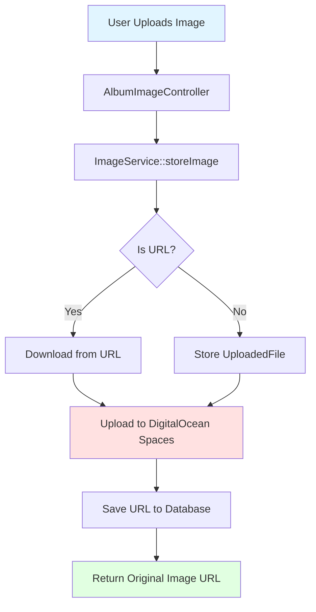
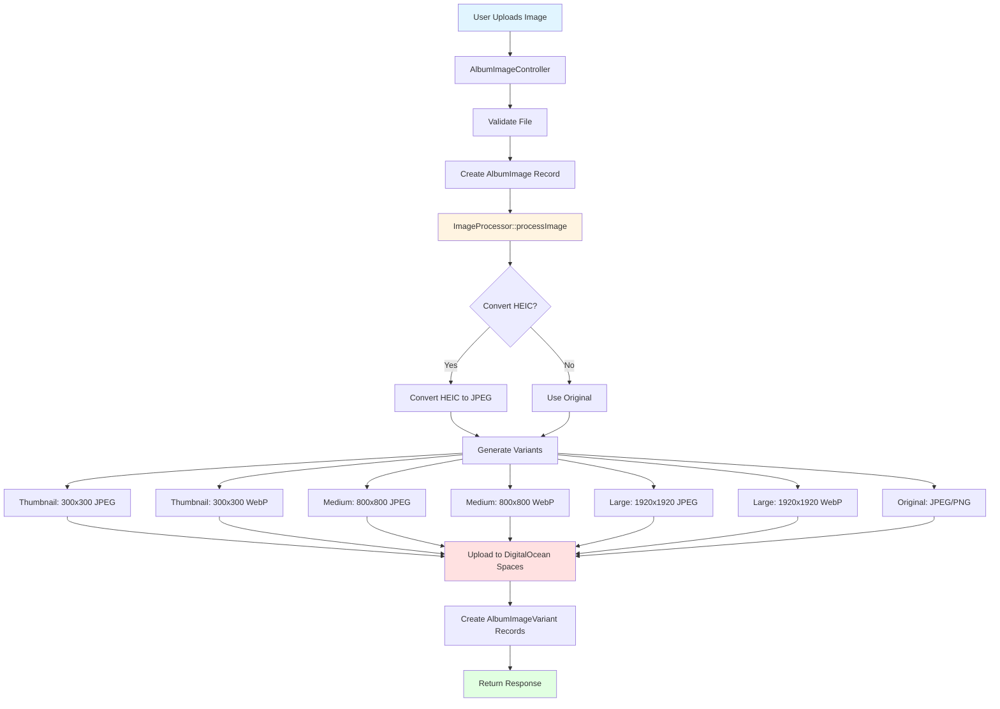

# Image Processing Enhancement - Plan of Attack

## Executive Summary

**Key Design Decisions:**
1. **Variants Table**: Using dedicated `album_image_variants` table instead of JSON storage - better for queries, relationships, and scalability
2. **Synchronous Processing**: No queue workers for now - process images immediately during upload (acceptable for single instance)
3. **Original as Variant**: The "original" image is stored as a variant type, ensuring consistent data model
4. **Future-Proof**: Architecture allows easy upgrade to async queue processing when scaling
5. **Backwards compatibilty**: Existing album images still need to work, maybe we need to migrate

**Table Schema:**
- `album_image_variants` table with columns: id, album_image_id, variant_type, width, height, format, dpi, file_path, file_url, file_size, quality
- One-to-many relationship: `AlbumImage hasMany AlbumImageVariant`

**Queue Workers Note:**
Yes, a single instance CAN run queue workers alongside the web server! Laravel supports this via supervisor/systemd/background processes. However, for simplicity, this plan uses synchronous processing initially. See Phase 2 for details.

**Backwards Compatibility Strategy:**
Existing `album_images` records must continue to work. The `path` column will remain as fallback for legacy images. Helper methods will:
1. Check for variants first (new images)
2. Fall back to `path` if no variants exist (legacy images)
3. Optionally migrate legacy images to variants via batch command

**WebP Strategy:**
- **Default Behavior:** Generate WebP variants for all image types that support it (JPEG, PNG, GIF)
- **Fallback:** JPEG variants are always generated as fallback for browsers without WebP support
- **Frontend:** Uses `<picture>` elements or content negotiation to serve WebP to supporting browsers, JPEG to others
- **Benefits:** 20-30% smaller file sizes with same visual quality, better mobile performance

---

## 0. Prerequisites: Staging Environment Setup (BEFORE Implementation)

**CRITICAL:** This phase must be completed BEFORE starting image processing work. We need realistic test data to validate backwards compatibility and migration strategies.

### Phase 0.1: Setup Staging Database

**What:** Configure separate staging database environment

**Why:** Isolate testing from production, allows safe migration testing

**How:**
1. Create staging database in DigitalOcean or local
2. Copy production schema (structure only, no data)
3. Configure `.env.staging` with staging database credentials
4. Set up separate Docker service for staging if needed

**Files:**
- `.env.staging` (new)
- `docker-compose.staging.yml` (optional, for staging deployment)

**Testing:** Verify staging database connection works

---

### Phase 0.2: Create Comprehensive Staging Seeder

**What:** Build realistic seeders that populate albums with images in current format (legacy data simulation)

**Why:** Need test data that matches production structure to validate:
- Backwards compatibility works
- Migration scripts handle existing data
- Frontend displays both old and new images correctly

**How:**
```php
// database/seeders/StagingSeeder.php
class StagingSeeder extends Seeder
{
    public function run(): void
    {
        // Create multiple users
        $users = User::factory(5)->create();
        
        foreach ($users as $user) {
            // Create albums with various configurations
            $albums = Album::factory(3)->for($user)->create();
            
            foreach ($albums as $album) {
                // Create album images in LEGACY format (path only, no variants)
                // Simulate existing production data
                AlbumImage::factory(10)->for($album)->create([
                    'path' => $this->generateLegacyImageUrl(), // Existing format
                    // NO variants - simulating pre-migration state
                ]);
                
                // Mix in some videos too
                AlbumImage::factory(2)->for($album)->create([
                    'path' => 'https://www.youtube.com/watch?v=...',
                    'properties' => [
                        'type' => 'video',
                        'thumbnail_url' => 'https://...',
                    ],
                ]);
            }
        }
        
        // Create one album with MANY images (stress test)
        $largeAlbum = Album::factory()->for($users->first())->create([
            'title' => 'Large Album (Stress Test)',
        ]);
        AlbumImage::factory(100)->for($largeAlbum)->create();
    }
    
    private function generateLegacyImageUrl(): string
    {
        // Generate URLs that match existing production format
        // e.g., https://ams3.digitaloceanspaces.com/bengijzel/albums/{uuid}/{filename}.jpg
    }
}
```

**Files:**
- `database/factories/AlbumFactory.php` (new)
- `database/factories/AlbumImageFactory.php` (new)
- `database/seeders/StagingSeeder.php` (new)
- `database/seeders/DatabaseSeeder.php` - Call StagingSeeder

**Seed Data Requirements:**
- ✅ Multiple users with albums
- ✅ Albums with varying image counts (small: 5, medium: 20, large: 100+)
- ✅ Legacy format images (path only, no variants table entries)
- ✅ Videos mixed in (YouTube/Vimeo)
- ✅ Albums with cover images
- ✅ Images with metadata (titles, captions, alt text)
- ✅ Edge cases: empty albums, albums with only videos

**Testing:**
- Verify seeder runs without errors
- Check data matches production structure
- Validate relationships work correctly

---

### Phase 0.3: Verify Current System Works with Seed Data

**What:** Test existing functionality with seeded data

**Why:** Establish baseline - everything must work before adding variants

**How:**
1. Run seeder on staging database
2. Test all existing features:
   - View albums list
   - View album detail page
   - Display images in grid
   - Open image modal
   - Upload new images
   - Delete images
   - Edit image metadata
   - Reorder images
   - Set album cover

**Acceptance Criteria:**
- ✅ All existing features work perfectly with seeded data
- ✅ No regressions introduced
- ✅ Performance is acceptable
- ✅ Frontend displays all images correctly

**Files:**
- Test suite updates if needed
- Manual testing checklist

**Testing:** Full regression test with seeded data

---

## 1. Qualitative Story

### Problem Description
Currently, VAMS stores uploaded images in their original format and size without any optimization or transformation. This creates several pain points:

1. **Performance Issues**: Large original images (often 5-10MB from modern cameras/phones) are served directly to end users, causing slow page loads
2. **Mobile Experience**: Desktop-sized images consume excessive mobile bandwidth and load slowly
3. **Storage Costs**: Original files take up unnecessary space when smaller variants would suffice for most use cases
4. **HEIC Format**: iPhone photos in HEIC format aren't universally supported by all browsers
5. **Lack of Flexibility**: No ability to crop, resize, or adjust images after upload without re-uploading

### Business Impact
- **User Experience**: Slow loading times frustrate users and reduce engagement
- **Costs**: Higher storage and bandwidth costs from serving oversized images
- **Adoption**: Mobile users may abandon the platform due to poor performance
- **Professional Appeal**: Lack of image editing capabilities limits the platform's professional use cases

### Solution Approach
Implement a comprehensive image processing pipeline that:
1. Automatically generates multiple size variants (thumbnail, medium, large, original) stored in a dedicated variants table
2. Converts images to modern formats (WebP) with fallbacks
3. Applies intelligent compression while preserving quality
4. Converts HEIC/HEIF to universally supported formats
5. Provides manual editing capabilities (crop, resize, rotate, filters)
6. Processes images synchronously (can be upgraded to async queues when needed)

### Success Metrics
- **Performance**: 70% reduction in average image payload size
- **Load Time**: Page load times under 2 seconds on 4G mobile connections
- **Storage**: 50% reduction in storage requirements through compression
- **User Satisfaction**: Image upload and page load experience rated 4.5+ stars
- **Format Support**: 100% browser compatibility for all uploaded images

---

## 2. Technical Implementation

### Current Architecture



**Current Flow Issues:**
- Single image stored (original only)
- No processing or optimization
- HEIC files may fail validation
- Synchronous processing blocks the request
- No variants for responsive images

### Enhanced Architecture



**Enhanced Flow Benefits:**
- Multiple variants for responsive images (stored in dedicated table)
- Format conversion for compatibility (HEIC → JPEG)
- WebP support for modern browsers
- Structured data model with proper relationships
- Can be upgraded to async processing when scaling

### Key Code Changes

#### New ImageProcessor Service

```php
<?php

declare(strict_types=1);

namespace App\Services;

use App\Models\AlbumImageVariant;
use Intervention\Image\ImageManager;
use Intervention\Image\Interfaces\ImageInterface;
use Illuminate\Support\Collection;
use Illuminate\Support\Facades\Storage;
use Illuminate\Support\Str;

final class ImageProcessor
{
    private const VARIANTS = [
        'thumbnail' => ['width' => 300, 'height' => 300, 'quality' => 80],
        'medium' => ['width' => 800, 'height' => 800, 'quality' => 85],
        'large' => ['width' => 1920, 'height' => 1920, 'quality' => 90],
    ];
    
    public function __construct(
        private readonly ImageManager $imageManager,
        private readonly ImageService $imageService
    ) {}
    
    /**
     * Process an image and create all variants
     * 
     * @param string $imagePath Path to uploaded image file
     * @param string $folder Storage folder (e.g., "albums/{album_id}")
     * @param string $albumImageId UUID of the parent AlbumImage
     * @return Collection<int, AlbumImageVariant>
     */
    public function processImage(string $imagePath, string $folder, string $albumImageId): Collection
    {
        $image = $this->imageManager->read($imagePath);
        $variants = collect();
        
        // Get original dimensions and format
        $originalWidth = $image->width();
        $originalHeight = $image->height();
        $originalFormat = $this->detectFormat($imagePath);
        
        // Generate all size variants
        foreach (self::VARIANTS as $variantType => $config) {
            // Generate JPEG variant
            $jpegVariant = $this->createVariant(
                $image,
                $variantType,
                $config,
                $folder,
                $albumImageId,
                'jpeg'
            );
            if ($jpegVariant) {
                $variants->push($jpegVariant);
            }
            
            // Generate WebP variant by default (better compression, modern browsers)
            // Frontend uses <picture> elements for JPEG fallback support
            if ($this->canConvertToWebp($originalFormat)) {
                $webpVariant = $this->createVariant(
                    $image,
                    $variantType,
                    $config,
                    $folder,
                    $albumImageId,
                    'webp'
                );
                if ($webpVariant) {
                    $variants->push($webpVariant);
                }
            }
        }
        
        // Store original (compressed)
        $originalVariant = $this->storeOriginal(
            $image,
            $folder,
            $albumImageId,
            $originalFormat,
            $originalWidth,
            $originalHeight
        );
        if ($originalVariant) {
            $variants->push($originalVariant);
        }
        
        return $variants;
    }
    
    private function createVariant(
        ImageInterface $image,
        string $variantType,
        array $config,
        string $folder,
        string $albumImageId,
        string $format
    ): ?AlbumImageVariant {
        // Implementation details...
        // Resize image, convert format, upload to storage, create variant record
    }
}
```

**Note:** ImageProcessor uses constructor injection for ImageManager and ImageService (Laravel best practice). ImageService will handle storage operations, ImageProcessor handles transformations only.

#### New AlbumImageVariant Model & Migration

```php
// Migration: create_album_image_variants_table.php
Schema::create('album_image_variants', function (Blueprint $table) {
    $table->uuid('id')->primary();
    $table->foreignUuid('album_image_id')->constrained('album_images')->onDelete('cascade');
    $table->string('variant_type'); // 'original', 'thumbnail', 'medium', 'large'
    $table->integer('width')->nullable();
    $table->integer('height')->nullable();
    $table->string('format'); // 'jpeg', 'png', 'webp', 'gif'
    $table->integer('dpi')->nullable(); // Dots per inch for print quality
    $table->string('file_path'); // Path in storage
    $table->string('file_url'); // Full URL for access
    $table->integer('file_size'); // Size in bytes
    $table->integer('quality')->nullable(); // Compression quality 0-100
    $table->timestamps();
    
    $table->index(['album_image_id', 'variant_type']);
});

// Model: AlbumImageVariant.php
<?php

declare(strict_types=1);

namespace App\Models;

use Illuminate\Database\Eloquent\Concerns\HasUuids;
use Illuminate\Database\Eloquent\Factories\HasFactory;
use Illuminate\Database\Eloquent\Model;
use Illuminate\Database\Eloquent\Relations\BelongsTo;

class AlbumImageVariant extends Model
{
    use HasFactory, HasUuids;
    
    protected $fillable = [
        'album_image_id',
        'variant_type',
        'width',
        'height',
        'format',
        'dpi',
        'file_path',
        'file_url',
        'file_size',
        'quality',
    ];

    /**
     * Get the attributes that should be cast.
     *
     * @return array<string, string>
     */
    protected function casts(): array
    {
        return [
            'width' => 'integer',
            'height' => 'integer',
            'dpi' => 'integer',
            'file_size' => 'integer',
            'quality' => 'integer',
        ];
    }
    
    public function albumImage(): BelongsTo
    {
        return $this->belongsTo(AlbumImage::class);
    }
}

// Updated AlbumImage Model (WITH BACKWARDS COMPATIBILITY)
// Note: This code will be added to existing app/Models/AlbumImage.php
// Already updated above with strict types, return types, and casts() method

    /**
     * Get thumbnail variant with fallback to legacy path
     * 
     * @return AlbumImageVariant|null
     */
    public function getThumbnailVariant(): ?AlbumImageVariant
    {
        return $this->variants()
            ->where('variant_type', 'thumbnail')
            ->where('format', 'webp')
            ->first() 
            ?? $this->variants()->where('variant_type', 'thumbnail')->first();
    }
    
    /**
     * Get thumbnail URL - backwards compatible
     */
    public function getThumbnailUrlAttribute(): string
    {
        $variant = $this->getThumbnailVariant();
        return $variant?->file_url ?? $this->path; // Fallback to legacy path
    }
    
    /**
     * Get responsive URL - backwards compatible
     */
    public function getResponsiveUrlAttribute(): string
    {
        // Try to get medium variant (WebP preferred, then JPEG)
        $medium = $this->variants()
            ->where('variant_type', 'medium')
            ->where('format', 'webp')
            ->first()
            ?? $this->variants()
                ->where('variant_type', 'medium')
                ->first();
            
        if ($medium) {
            return $medium->file_url;
        }
        
        // Try large as fallback
        $large = $this->variants()
            ->where('variant_type', 'large')
            ->first();
            
        if ($large) {
            return $large->file_url;
        }
        
        // Final fallback: legacy path column (backwards compatibility)
        return $this->path;
    }
    
    /**
     * Get original variant URL or fallback to path
     */
    public function getOriginalUrlAttribute(): string
    {
        $original = $this->variants()
            ->where('variant_type', 'original')
            ->first();
            
        return $original?->file_url ?? $this->path;
    }
```

---

## 3. Step-by-Step Implementation Plan

### Phase 0: Staging Environment & Seeders (Week 0 - PREREQUISITE)

**⚠️ MUST BE COMPLETED BEFORE PHASE 1**

**Step 0.1: Setup Staging Database**
- Create staging database
- Configure environment
- Verify connection

**Step 0.2: Create Comprehensive Seeders**
- AlbumFactory with realistic data (using Laravel factories best practices)
- AlbumImageFactory (legacy format simulation - path only, no variants)
- StagingSeeder with various scenarios
- Test seeder execution
- **File Preparation:** Clean up commented code in DatabaseSeeder

**Step 0.3: Validate Current System**
- Full regression testing with seeded data
- Establish baseline functionality
- Document any issues found

**Deliverable:** Staging environment ready with realistic test data matching production structure

---

### Phase 1: Foundation Setup (Week 1)

**Step 1.1: Install Image Processing Library**

**What:** Install Intervention Image v3 (modern PHP image processing library)

**Why:** Provides powerful, Laravel-friendly image manipulation with GD/Imagick support

**How:**
```bash
docker compose exec api composer require intervention/image:^3.0
```

**Files:**
- `composer.json` - Add dependency
- `composer.lock` - Lock version

**Testing:** Verify installation with `docker compose exec api php artisan tinker` and load the library

---

**Step 1.2: Create ImageProcessor Service**

**What:** Build a dedicated service for all image processing operations

**Why:** Separation of concerns - keep ImageService for storage, ImageProcessor for transformations

**How:**
- Create `app/Services/ImageProcessor.php` with strict types and proper dependency injection
- Implement variant generation methods that create `AlbumImageVariant` records
- Add HEIC conversion support
- Implement WebP conversion using Intervention Image (not GD)
- Use ImageService for storage operations (don't duplicate storage logic)
- Return Collection of created variant models
- Follow Laravel 11 patterns (use `casts()` method, proper return types)
- **WebP Strategy:** Generate WebP variants by default alongside JPEG (with browser fallback via `<picture>` elements)

**Files:**
- `app/Services/ImageProcessor.php` (new)
- `app/Providers/AppServiceProvider.php` - Register ImageManager and ImageProcessor in service container

**Best Practices:**
- ✅ Use constructor injection (ImageManager, ImageService)
- ✅ Declare strict types (`declare(strict_types=1)`)
- ✅ Use return type hints for all methods
- ✅ Keep ImageService for storage, ImageProcessor for transformations

**Key Method Signature:**
```php
/**
 * Process an image and create all variants
 * 
 * @param string $imagePath Path to uploaded image file
 * @param string $folder Storage folder (e.g., "albums/{album_id}")
 * @param string $albumImageId UUID of the parent AlbumImage
 * @return \Illuminate\Support\Collection<AlbumImageVariant>
 */
public function processImage(string $imagePath, string $folder, string $albumImageId): Collection
```

**Testing:** Unit tests for each transformation method, verify variant models are created

---

**Step 1.2.5: Review and Document ImageService Integration**

**What:** Document how ImageProcessor will use ImageService

**Why:** Ensure clear separation of concerns and avoid duplication

**How:**
- Document that ImageProcessor will inject ImageService
- ImageProcessor calls `ImageService::storeUploadedFile()` for storage
- ImageProcessor calls `ImageService::getPublicUrl()` for URL generation
- Keep ImageService WebP methods as-is (may be used by other parts of system)
- ImageProcessor uses Intervention Image for all transformations

**Files:**
- `docs/IMAGE_PROCESSING_PLAN.md` - Already documented above
- Code comments in ImageProcessor

**Testing:** Verify ImageProcessor can access ImageService methods

---

**Step 1.3: Create Database Migration for Variants Table**

**What:** Create new `album_image_variants` table to store all image variants

**Why:** Need a proper relational structure to store multiple variants per image with metadata

**How:**
```php
// database/migrations/YYYY_MM_DD_create_album_image_variants_table.php
Schema::create('album_image_variants', function (Blueprint $table) {
    $table->uuid('id')->primary();
    $table->foreignUuid('album_image_id')
        ->constrained('album_images')
        ->onDelete('cascade');
    $table->string('variant_type'); // 'original', 'thumbnail', 'medium', 'large'
    $table->integer('width')->nullable();
    $table->integer('height')->nullable();
    $table->string('format'); // 'jpeg', 'png', 'webp', 'gif'
    $table->integer('dpi')->nullable(); // Dots per inch for print quality
    $table->string('file_path'); // Path in storage (e.g., 'albums/uuid/thumb-abc123.jpg')
    $table->string('file_url'); // Full URL (e.g., 'https://ams3.digitaloceanspaces.com/...')
    $table->integer('file_size'); // Size in bytes
    $table->integer('quality')->nullable(); // Compression quality 0-100
    $table->timestamps();
    
    // Index for efficient lookups
    $table->index(['album_image_id', 'variant_type']);
});
```

**Files:**
- `database/migrations/YYYY_MM_DD_create_album_image_variants_table.php` (new)
- `app/Models/AlbumImageVariant.php` (new)
- `app/Models/AlbumImage.php` - Add relationship and helper methods

**Testing:** Run migration up/down to verify schema changes, test relationship queries

---

### Phase 2: Synchronous Processing Implementation (Week 2)

**Note on Queue Workers:** 
Yes, Sire! A single instance CAN run both web server and queue workers! Laravel allows you to run `php artisan queue:work` or `php artisan queue:listen` as a background process on the same server. However, for now we'll use **synchronous processing** to keep things simple and avoid worker complexity. This can easily be upgraded to async queues later when scaling.

**How Queue Workers Work on Same Instance:**
- The web server (nginx/php-fpm) handles HTTP requests
- Queue workers are separate PHP processes that run `php artisan queue:work` 
- You can run workers via:
  - Supervisord (production recommended)
  - Systemd service
  - Docker container
  - Background process (`nohup php artisan queue:work &`)
- Both can run simultaneously without conflict
- Your `composer.json` dev script already shows `queue:listen` running alongside the server

**For Now: Synchronous Processing**
- Process images immediately during upload (acceptable for single instance)
- Keep request timeouts reasonable (< 30 seconds)
- Can upgrade to queues later when needed

---

**Step 2.1: Update AlbumImageController for Synchronous Processing**

**What:** Integrate ImageProcessor into upload flow to process images immediately

**Why:** Keep implementation simple for single instance deployment

**How:**
```php
public function store(Request $request, Album $album)
{
    $request->validate([
        'images' => 'required|array',
        'images.*' => 'required|file|mimes:jpeg,png,jpg,gif,webp,heic,heif|max:20480',
    ]);
    
    $this->authorize('update', $album);
    
    $lastOrder = $album->images()->max('order') ?? -1;
    $uploadedImages = [];
    
    foreach ($request->file('images') as $image) {
        // Create temporary path for processing
        $tempPath = $image->getRealPath();
        
        // Create AlbumImage record first
        $albumImage = $album->images()->create([
            'id' => Str::uuid(),
            'path' => '', // Will be set from variant
            'order' => ++$lastOrder
        ]);
        
        // Process image and generate variants
        $variants = $this->imageProcessor->processImage(
            $tempPath, 
            "albums/{$album->id}",
            $albumImage->id
        );
        
        // Set primary path to original variant
        $originalVariant = $variants->firstWhere('variant_type', 'original');
        $albumImage->update(['path' => $originalVariant->file_url]);
        
        $uploadedImages[] = $albumImage;
    }
    
    return back()->with([
        'message' => 'Images uploaded successfully',
        'images' => $uploadedImages
    ]);
}
```

**Files:**
- `app/Http/Controllers/AlbumImageController.php` - Update `store()` method to call ImageProcessor
- `app/Services/ImageProcessor.php` - Implement `processImage()` method

**Testing:** Feature tests for upload flow, verify all variants are created

---

### Phase 3: Frontend Integration (Week 2)

**Step 3.1: Update Vue Components for Responsive Images**

**What:** Use appropriate image variant based on display context

**Why:** Serve optimal image size for each use case

**How:**
```vue

```

**Files:**
- `resources/js/Components/albums/AlbumGrid.vue`
- `resources/js/Components/albums/ImageModal.vue`
- `resources/js/Components/mosaics/*` - All mosaic components

**Testing:** Visual regression tests, test on various screen sizes

---

**Step 3.2: Add Processing Status UI**

**What:** Show upload progress and processing status to users

**Why:** Users need feedback when images are still processing

**How:**
- Display spinner/skeleton for images with `processing_status='processing'`
- Show error state for failed processing
- Auto-refresh when processing completes (via WebSocket or polling)

**Files:**
- `resources/js/Components/albums/AlbumGrid.vue` - Add status indicators
- `resources/js/Composables/useAlbum.ts` - Add polling logic

**Testing:** Test all processing states (pending, processing, completed, failed)

---

### Phase 4: Advanced Features (Week 3)

**Step 4.1: HEIC/HEIF Conversion**

**What:** Automatically convert Apple's HEIC format to JPEG

**Why:** HEIC isn't supported in all browsers

**How:**
- Check file extension/mime type
- Use ImageProcessor to convert to JPEG
- Preserve EXIF data during conversion

**Files:**
- `app/Services/ImageProcessor.php` - Add `convertHeic()` method
- `app/Jobs/ProcessImageUpload.php` - Add HEIC detection

**Testing:** Test with actual HEIC files from iPhone

---

**Step 4.2: Image Editing Capabilities**

**What:** Allow users to crop, rotate, and adjust uploaded images

**Why:** Users often need to fix orientation or crop images after upload

**How:**
1. Add edit button to ImageModal
2. Create ImageEditor component with crop/rotate tools
3. Send edit instructions to backend
4. Reprocess image with edits applied

**Files:**
- `resources/js/Components/albums/ImageEditor.vue` (new)
- `app/Http/Controllers/AlbumImageController.php` - Add `edit()` endpoint
- `app/Jobs/ProcessImageEdit.php` (new)

**Testing:** Test each editing operation, ensure variants are regenerated

---

**Step 4.3: Automatic Format Detection & Optimization**

**What:** Serve WebP to supporting browsers, JPEG to others

**Why:** WebP provides better compression while maintaining quality

**How:**
- Generate WebP variants alongside JPEG
- Use `<picture>` elements or content negotiation
- Implement automatic quality adjustment based on image content

**Files:**
- `app/Services/ImageProcessor.php` - Add WebP generation
- `resources/js/Components/shared/ResponsiveImage.vue` (new)

**Testing:** Test in Chrome (WebP support) and Safari (fallback)

---

### Phase 5: Optimization & Polish (Week 4)

**Step 5.1: Implement Smart Compression**

**What:** Analyze images and apply optimal compression without visible quality loss

**Why:** Balance file size and quality for best user experience

**How:**
- Implement perceptual quality analysis
- Adjust compression based on image complexity
- Target specific file size thresholds

**Files:**
- `app/Services/ImageProcessor.php` - Add smart compression logic

**Testing:** A/B testing with various image types (photos, graphics, screenshots)

---

**Step 5.2: Add Batch Processing & Migration Command**

**What:** Artisan command to migrate legacy images and reprocess existing images

**Why:** Convert existing `album_images` to variant-based system, apply new processing to old images

**How:**
```php
// app/Console/Commands/MigrateLegacyImages.php
php artisan images:migrate-legacy --chunk=100 --dry-run

// Creates variants from existing path column
// For each AlbumImage without variants:
// 1. Download image from current path
// 2. Process it through ImageProcessor
// 3. Create variants table entries
// 4. Keep original path as fallback

// app/Console/Commands/ReprocessImages.php
php artisan images:reprocess --chunk=100

// Reprocess existing variants (if processing settings change)
```

**Migration Strategy:**
1. **Detection:** Find all `AlbumImage` records where `variants()->count() === 0`
2. **Download:** Fetch image from existing `path` URL
3. **Process:** Run through `ImageProcessor` to generate variants
4. **Store:** Create `AlbumImageVariant` records
5. **Preserve:** Keep original `path` column unchanged (backwards compatibility)
6. **Validation:** Verify variants work correctly

**Files:**
- `app/Console/Commands/MigrateLegacyImages.php` (new)
- `app/Console/Commands/ReprocessImages.php` (new)

**Safety Features:**
- Dry-run mode to preview changes
- Chunk processing to avoid memory issues
- Progress reporting
- Rollback capability
- Validation checks before migration

**Testing:** Run on staging database with seeded legacy data

---

**Step 5.3: Monitoring & Error Handling**

**What:** Add comprehensive logging and alerting for processing failures

**Why:** Catch and fix issues before users report them

**How:**
- Log all processing steps
- Alert on high failure rates
- Implement retry logic with exponential backoff
- Add admin dashboard for failed images

**Files:**
- `app/Jobs/ProcessImageUpload.php` - Enhanced error handling
- `app/Http/Controllers/Admin/ImageProcessingController.php` (new)

**Testing:** Simulate failures and verify recovery

---

## 4. Test Scenarios

### Regression Tests (Existing Functionality)

✅ **Upload Standard Images**
- Upload JPEG, PNG, GIF images
- Verify images display correctly in album grid
- Verify images display in modal view
- Verify images can be reordered

✅ **Delete Images**
- Delete image and verify it's removed from storage
- Verify album updates correctly

✅ **Update Image Metadata**
- Update title, caption, alt text
- Verify changes persist

✅ **Album Cover Images**
- Set album cover from uploaded images
- Verify cover displays correctly

### New Functionality Tests

✅ **Multi-Variant Generation**
- Upload image and verify all variants are created
- Verify thumbnail, medium, large, and original exist
- Verify dimensions are correct for each variant
- Verify file sizes decrease appropriately

✅ **HEIC Conversion**
- Upload HEIC image from iPhone
- Verify it converts to JPEG successfully
- Verify EXIF data is preserved
- Verify image displays correctly

✅ **WebP Generation**
- Verify WebP variants are generated
- Verify WebP is served to supporting browsers
- Verify JPEG fallback for unsupported browsers

✅ **Synchronous Processing**
- Upload image and verify all variants are created
- Verify processing completes within reasonable time (< 30 seconds)
- Verify error handling if processing fails
- Verify user sees completed image immediately

✅ **Responsive Images**
- Verify correct variant is served on mobile
- Verify correct variant is served on desktop
- Verify srcset attributes are correct
- Verify lazy loading works

✅ **Image Editing**
- Crop image and verify preview
- Rotate image and verify orientation
- Apply edits and verify variants are regenerated
- Verify original is preserved

✅ **Batch Migration (Backwards Compatibility)**
- Run migrate-legacy command on staging data
- Verify legacy images get variants created
- Verify original path column preserved
- Verify frontend displays both old and new images
- Test dry-run mode
- Test chunk processing
- Verify rollback works if needed

✅ **Batch Reprocessing**
- Run reprocess command on existing images
- Verify all images are queued
- Verify processing completes successfully
- Verify variants are regenerated correctly

### Error Scenarios

❌ **Upload Corrupted Image**
- Verify error is caught and logged
- Verify user-friendly error message
- Verify original upload is not lost

❌ **Processing Timeout**
- Simulate slow processing
- Verify job timeout is handled
- Verify job is retried

❌ **Storage Failure**
- Simulate DigitalOcean Spaces outage
- Verify graceful failure
- Verify retry mechanism

❌ **Queue Worker Failure**
- Simulate worker crash
- Verify jobs are not lost
- Verify processing resumes

---

## 5. Risk Assessment & Mitigation

### High Risk

🔴 **Storage Costs Increase**
- **Risk:** Storing 4-5 variants per image increases storage needs
- **Impact:** Higher monthly costs from DigitalOcean Spaces
- **Mitigation:**
  - Implement lifecycle policies to delete unused variants
  - Compress aggressively for smaller variants
  - Monitor storage usage and set alerts
  - Provide option to disable certain variants per user/plan tier

🔴 **Processing Queue Backlog**
- **Risk:** Large upload batches could overwhelm queue workers
- **Impact:** Users wait long time for images to process
- **Mitigation:**
  - Use separate queue for image processing
  - Scale workers horizontally based on queue depth
  - Implement rate limiting on uploads
  - Show clear progress indicators to users
  - Process batches in chunks

🔴 **HEIC Conversion Quality Loss**
- **Risk:** Converting HEIC to JPEG may reduce quality
- **Impact:** Professional photographers may be dissatisfied
- **Mitigation:**
  - Use high-quality conversion settings
  - Provide option to keep HEIC as original
  - Test conversion quality extensively
  - Allow re-upload if unsatisfied

### Medium Risk

🟡 **Breaking Changes to Existing API**
- **Risk:** Adding new fields might break API consumers
- **Impact:** External integrations may fail
- **Mitigation:**
  - Version the API (v2) with new structure
  - Maintain backward compatibility for v1
  - Provide migration guide
  - Deprecate old format gradually

🟡 **Frontend Performance with srcset**
- **Risk:** Complex srcset logic may impact render performance
- **Impact:** Slight delay in image rendering
- **Mitigation:**
  - Use Vue composable to centralize logic
  - Implement proper lazy loading
  - Test on low-end devices
  - Provide fallback to single image

🟡 **Migration Data Volume**
- **Risk:** Reprocessing thousands of existing images takes days
- **Impact:** Delayed feature rollout
- **Mitigation:**
  - Process in small batches (chunk parameter)
  - Prioritize recent/frequently accessed images
  - Process on-demand when image is accessed (lazy migration)
  - Run migration during low-traffic periods
  - Provide progress reporting and resume capability

🟡 **Backwards Compatibility Breaks**
- **Risk:** Legacy images might not display correctly
- **Impact:** Existing albums broken, user complaints
- **Mitigation:**
  - Comprehensive fallback logic in model accessors
  - Extensive testing with seeded legacy data
  - Migration runs in staging first
  - Keep `path` column unchanged for safety
  - Feature flag to disable variant system if needed

### Low Risk

🟢 **Image Processing Library Bugs**
- **Risk:** Intervention Image may have edge case bugs
- **Impact:** Some images fail to process
- **Mitigation:**
  - Comprehensive testing with diverse image set
  - Implement fallback to store original if processing fails
  - Monitor error logs and report issues upstream

🟢 **Browser Compatibility Issues**
- **Risk:** Some browsers may not display images correctly
- **Impact:** Poor UX for small subset of users
- **Mitigation:**
  - Use progressive enhancement approach
  - Provide JPEG fallbacks everywhere
  - Test on major browsers (Chrome, Safari, Firefox, Edge)

---

## 6. Success Criteria

### Functional Requirements

✅ **Image Variants**
- [ ] System generates thumbnail (300px), medium (800px), large (1920px) variants
- [ ] All variants are stored in DigitalOcean Spaces
- [ ] Variants are referenced in AlbumImage model
- [ ] Original image is preserved

✅ **Format Support**
- [ ] HEIC/HEIF images are automatically converted to JPEG
- [ ] WebP variants are generated for all images
- [ ] JPEG fallbacks are provided for all images
- [ ] EXIF data is preserved during conversions

✅ **Synchronous Processing**
- [ ] Image uploads process completely during request
- [ ] Processing completes within reasonable time (< 30 seconds)
- [ ] Users see completed image immediately
- [ ] Error handling works correctly

✅ **Backwards Compatibility**
- [ ] Legacy images (path only) display correctly
- [ ] New images (with variants) display correctly
- [ ] Both formats work side-by-side
- [ ] Migration command successfully converts legacy images
- [ ] No breaking changes to existing API

✅ **Responsive Images**
- [ ] Correct variant is served based on viewport size
- [ ] srcset and sizes attributes are correct
- [ ] Images lazy load below the fold
- [ ] Mobile users see 50%+ reduction in image data

✅ **Image Editing**
- [ ] Users can crop uploaded images
- [ ] Users can rotate images (90° increments)
- [ ] Edits regenerate all variants
- [ ] Original is preserved for future edits

### Technical Requirements

✅ **Performance**
- [ ] Thumbnail variant loads in < 200ms
- [ ] Medium variant loads in < 500ms
- [ ] Large variant loads in < 1000ms
- [ ] Processing queue handles 100+ uploads/hour

✅ **Quality**
- [ ] No visible quality degradation from compression
- [ ] Compressed images are 60-70% smaller than originals
- [ ] WebP variants are 20-30% smaller than JPEG equivalents

✅ **Reliability**
- [ ] 99.9% success rate for image processing
- [ ] Failed jobs are retried 3 times with backoff
- [ ] Errors are logged and monitored
- [ ] Users are notified of persistent failures

✅ **Scalability**
- [ ] System handles 1000+ images/day without degradation
- [ ] Migration processes large datasets efficiently
- [ ] Storage costs remain under budget

### Business Requirements

✅ **User Experience**
- [ ] Upload process feels instant (no blocking)
- [ ] Images display quickly across all devices
- [ ] Clear feedback during processing
- [ ] Editing is intuitive and fast

✅ **Cost Efficiency**
- [ ] Storage cost increase is < 150% of baseline
- [ ] Bandwidth costs decrease by 40%+
- [ ] Infrastructure scales efficiently

✅ **Compatibility**
- [ ] Works on iOS Safari, Chrome, Firefox, Edge
- [ ] HEIC uploads work from iPhone
- [ ] No breaking changes to existing API

---

## 7. Files to Modify

### New Files

**Backend:**
- `app/Services/ImageProcessor.php` - Core image processing logic (new)
- `app/Models/AlbumImageVariant.php` - Variant model (new)
- `app/Console/Commands/MigrateLegacyImages.php` - Migrate existing images to variants (new)
- `app/Console/Commands/ReprocessImages.php` - Batch reprocessing (new)
- `database/migrations/YYYY_MM_DD_create_album_image_variants_table.php` (new)
- `database/factories/AlbumFactory.php` - Factory for seeding (new)
- `database/factories/AlbumImageFactory.php` - Factory for seeding (legacy format) (new)
- `database/seeders/StagingSeeder.php` - Comprehensive staging data (new)
- `tests/Unit/Services/ImageProcessorTest.php` (new)
- `tests/Unit/Models/AlbumImageVariantTest.php` (new)
- `tests/Feature/ImageProcessingTest.php` (new)
- `tests/Feature/BackwardsCompatibilityTest.php` - Test legacy images work (new)

**Files to Clean Up/Prepare:**
- `app/Models/AlbumImage.php` - ✅ Already updated with strict types, return types, casts() method, variants relationship stub
- `database/seeders/DatabaseSeeder.php` - ✅ Already cleaned up commented code

**Note:** Jobs and events removed for synchronous processing approach. Can be added later when upgrading to async.

**Frontend:**
- `resources/js/Components/shared/ResponsiveImage.vue` - Reusable responsive image component
- `resources/js/Components/albums/ImageEditor.vue` - Image editing interface
- `resources/js/Composables/useImageProcessing.ts` - Image processing state management

### Modified Files

**Backend:**
- `app/Http/Controllers/AlbumImageController.php` - Update store/update methods (inject ImageProcessor)
- `app/Services/ImageService.php` - ✅ Already has strict types added; add PHPDoc clarifying storage-only purpose
- `app/Models/AlbumImage.php` - ✅ Already updated with strict types, return types, casts() method, variants relationship
- `app/Providers/AppServiceProvider.php` - Register ImageManager and ImageProcessor in service container
- `composer.json` - Add intervention/image dependency
- `.env.example` - Add image processing configuration

**Frontend:**
- `resources/js/Components/albums/AlbumGrid.vue` - Use responsive images
- `resources/js/Components/albums/ImageModal.vue` - Show variants, add edit button
- `resources/js/Components/albums/AlbumCover.vue` - Use responsive cover image
- `resources/js/Composables/useAlbum.ts` - Handle processing status
- `resources/js/types/album.ts` - Add variants types

**Tests:**
- `tests/Feature/AlbumImageTest.php` - Update for new flow
- `tests/Feature/AlbumTest.php` - Update for variants

---

## 8. Implementation Timeline

### Week 0: Staging Setup (PREREQUISITE - Before Nov 4)

**Day 1: Staging Database**
- Setup staging database environment
- Configure `.env.staging`
- Test database connections

**Day 2-3: Seeders**
- Create AlbumFactory
- Create AlbumImageFactory (legacy format)
- Create StagingSeeder with comprehensive scenarios
- Test seeder with various data volumes

**Day 4-5: Validation & Code Cleanup**
- Run full regression tests with seeded data
- Verify all existing features work
- Clean up AlbumImage model (add strict types, return types, use casts() method)
- Document baseline performance
- Fix any issues found

**Deliverable:** Staging environment ready with realistic test data

---

### Week 1: Foundation (Nov 4-8, 2025)

**Day 1-2: Setup**
- Install Intervention Image
- Create ImageProcessor service
- Write unit tests for processing methods
- Create database migration

**Day 3-4: Core Processing**
- Implement variant generation
- Implement HEIC conversion
- Implement WebP generation
- Test with various image types

**Day 5: Integration**
- Update ImageService to use ImageProcessor
- Update AlbumImage model
- Run migration on dev environment

**Deliverable:** ImageProcessor service functional and tested

---

### Week 2: Synchronous Processing Implementation (Nov 11-15, 2025)

**Day 1-2: ImageProcessor Integration**
- Complete ImageProcessor implementation
- Update AlbumImageController to use ImageProcessor
- Integrate with ImageService for storage
- Test variant generation end-to-end

**Day 3: Variant Model & Relationships**
- Create AlbumImageVariant model
- Add relationships and helper methods
- Update AlbumImage model with variant accessors
- Test relationship queries

**Day 4-5: Frontend Integration**
- Update AlbumGrid to use variants
- Implement responsive image loading with srcset
- Add fallback handling for missing variants
- Test end-to-end upload flow

**Deliverable:** Synchronous image processing fully functional

---

### Week 3: Advanced Features (Nov 18-22, 2025)

**Day 1-2: Image Editing**
- Create ImageEditor Vue component
- Implement crop functionality
- Implement rotate functionality
- Create backend edit endpoint

**Day 3: Optimization**
- Implement smart compression
- Test compression quality
- Fine-tune quality settings

**Day 4: Batch Reprocessing**
- Create reprocess command
- Test on staging data
- Document command usage

**Day 5: Testing**
- Comprehensive feature testing
- Test HEIC uploads from iPhone
- Test on various browsers

**Deliverable:** All core features complete and tested

---

### Week 4: Polish & Deploy (Nov 25-29, 2025)

**Day 1: Error Handling**
- Add comprehensive error logging
- Implement retry logic
- Create admin view for failed jobs

**Day 2: Performance Testing**
- Load test with 1000+ images
- Monitor queue performance
- Optimize slow operations

**Day 3: Documentation**
- Update API documentation
- Write migration guide
- Document configuration options

**Day 4: Staging Deployment**
- Deploy to staging
- Run batch reprocess on existing images
- Monitor for issues

**Day 5: Production Deployment**
- Deploy to production
- Monitor error rates
- Communicate with users about new features

**Deliverable:** Feature live in production

---

## 9. Configuration Reference

### Environment Variables

```env
# Image Processing Configuration
IMAGE_PROCESSING_QUEUE=image-processing
IMAGE_PROCESSING_MAX_SIZE=20480 # KB
IMAGE_PROCESSING_TIMEOUT=300 # seconds

# Variant Configuration
IMAGE_VARIANT_THUMBNAIL_SIZE=300
IMAGE_VARIANT_MEDIUM_SIZE=800
IMAGE_VARIANT_LARGE_SIZE=1920

# Quality Settings
IMAGE_QUALITY_THUMBNAIL=80
IMAGE_QUALITY_MEDIUM=85
IMAGE_QUALITY_LARGE=90
IMAGE_QUALITY_WEBP=85

# Feature Flags
IMAGE_PROCESSING_ENABLED=true
IMAGE_WEBP_ENABLED=true
IMAGE_HEIC_CONVERSION_ENABLED=true
```

### Future Queue Configuration (When Upgrading to Async)

If you decide to upgrade to async processing later, you can add:

```php
// config/queue.php
'connections' => [
    'image-processing' => [
        'driver' => 'database',
        'table' => 'jobs',
        'queue' => 'image-processing',
        'retry_after' => 600,
        'after_commit' => true,
    ],
],
```

**Running Queue Workers on Same Instance:**
```bash
# Option 1: Background process
nohup php artisan queue:work --queue=image-processing > /dev/null 2>&1 &

# Option 2: Supervisor (production)
# Create /etc/supervisor/conf.d/vams-worker.conf
[program:vams-worker]
process_name=%(program_name)s_%(process_num)02d
command=php /var/www/artisan queue:work --sleep=3 --tries=3
autostart=true
autorestart=true
user=www-data
numprocs=2
redirect_stderr=true
stdout_logfile=/var/www/storage/logs/worker.log
```

---

## 10. Rollback Plan

If critical issues arise post-deployment:

1. **Disable Image Processing**
   ```bash
   # Set in .env
   IMAGE_PROCESSING_ENABLED=false
   ```

2. **Revert to Original Storage**
   ```bash
   php artisan down --message="Maintenance in progress"
   git revert <commit-hash>
   php artisan migrate:rollback
   docker compose up -d --build
   php artisan up
   ```

3. **Emergency Hotfix**
   - Set `IMAGE_PROCESSING_ENABLED=false` in `.env`
   - Images will upload directly without processing
   - No downtime required

4. **Data Recovery**
   - All original images are preserved
   - Variants can be regenerated anytime
   - No data loss risk

---

## 11. Post-Deployment Monitoring

### Metrics to Watch

1. **Queue Health**
   - Jobs processed per hour
   - Average processing time
   - Failed job rate
   - Queue depth

2. **Storage Usage**
   - Total storage size
   - Growth rate
   - Cost per GB

3. **Performance**
   - Page load times
   - Image load times
   - Time to First Contentful Paint

4. **Error Rates**
   - Processing failures
   - Upload failures
   - Conversion failures

### Alert Thresholds

- Queue depth > 1000 jobs
- Failed job rate > 5%
- Processing time > 60 seconds average
- Storage growth > 10GB/day

---

## Appendix: Design Pattern Recommendations

This implementation follows several established design patterns:

1. **[Strategy Pattern](https://refactoring.guru/design-patterns/strategy)** - ImageProcessor uses different strategies for different image formats
2. **[Queue Pattern](https://refactoring.guru/design-patterns/command)** - Async processing via Laravel queues (Command pattern variant)
3. **[Factory Pattern](https://refactoring.guru/design-patterns/factory-method)** - Creating different image variants
4. **[Observer Pattern](https://refactoring.guru/design-patterns/observer)** - Broadcasting events when processing completes
5. **[Adapter Pattern](https://refactoring.guru/design-patterns/adapter)** - Adapting different image formats to common interface

---

*This plan is a living document and should be updated as implementation progresses and requirements evolve.*

